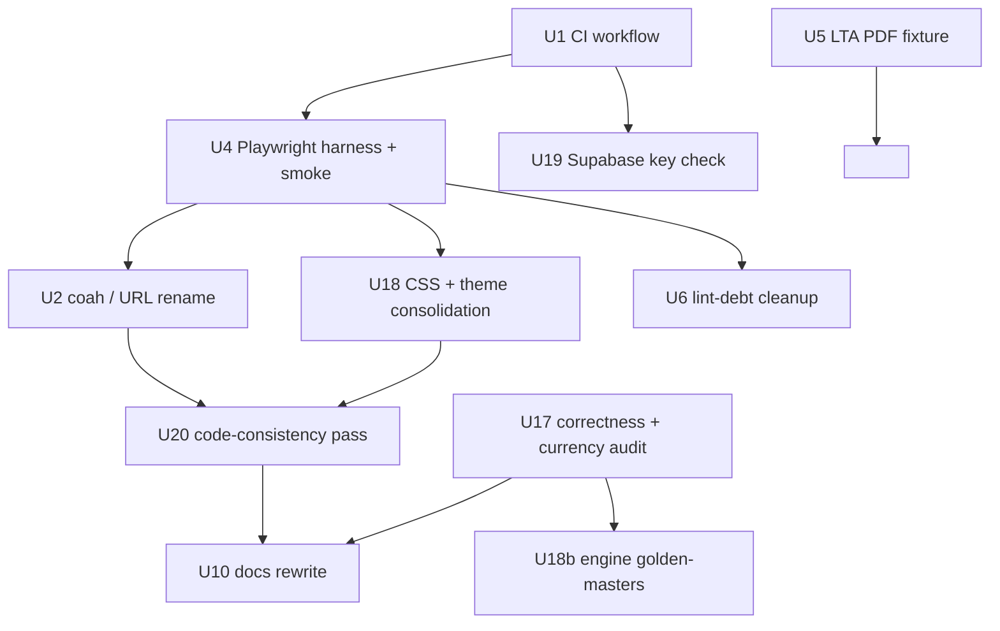
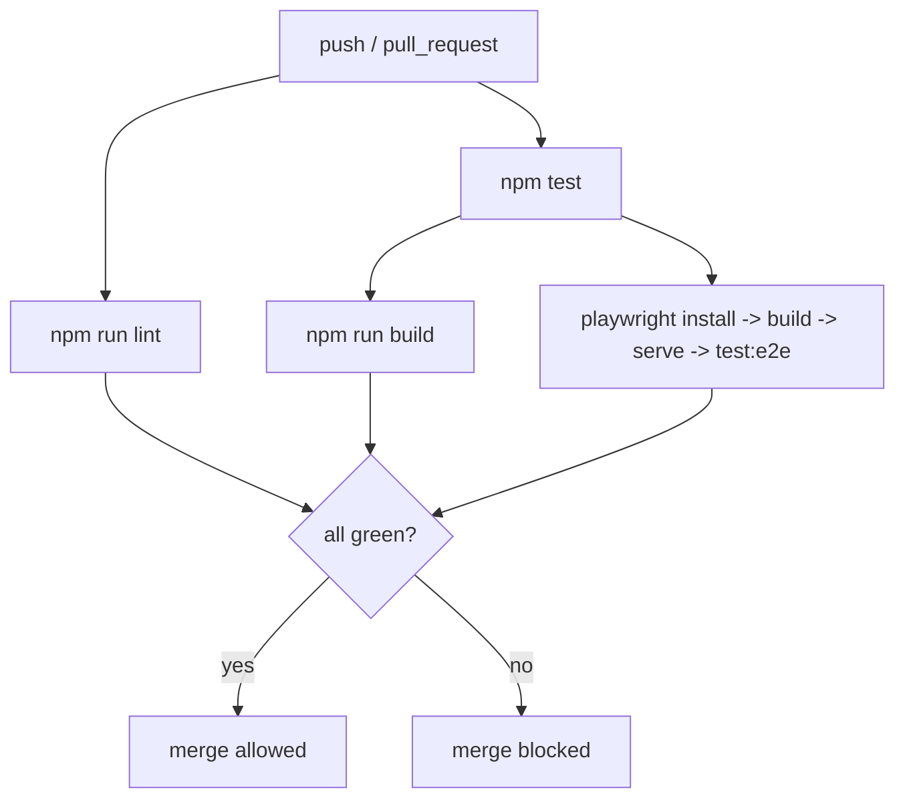

# natdtm Hardening - Plan

Make the eight shipped calculators in `natleewhee/natdtm` demonstrably trustworthy, tested, consistent, and documented — the codebase itself as the craft-piece showcase. No new features, no cross-tool layer, no vertical depth.

This plan was narrowed from an earlier A+D+B roadmap after a six-persona `ce-doc-review`. The cross-tool profile layer, the Tax×Retire reliefs optimizer, and all DriveReady depth work are deferred (see Scope Boundaries). The EV road-tax and insurance work in the earlier draft was dropped because `src/lib/drive/tco.js` already implements it.

---

## Goal Capsule

- **Objective:** A developer reading the repository sees eight calculators whose numbers are verified against dated authoritative sources, whose pages and forms are covered by tests, whose eight verticals follow one consistent structure, and whose README and architecture doc describe what actually ships.
- **Means:** One hardening milestone, landed as a few focused PRs (CI + brand; test harness + correctness audit; consolidation + consistency + docs). No behavioral change to any calculator's output except where the correctness audit finds a wrong constant. (KTD1)
- **Authority:** User is product owner. Craft-piece bar: when a choice trades speed against test coverage, consistency, or documentation, choose the latter.
- **Execution profile:** Standard code lifecycle — branch, `npm run lint`, `npm test`, `npm run build`, plus the new CI gate (U1) and Playwright suite (U4). The correctness audit (U17) is characterization-first: pin current behavior, then flag drift.
- **Stop conditions:** Stop and ask if any unit needs a user-data backend, authentication, a paid API, or a change to a calculator's methodology. Stop if the correctness audit finds a wrong shipping constant — that is a product decision, not a silent fix.
- **Tail ownership:** Implementer opens focused PRs per KTD1, not one hardening mega-PR.

---

## Product Contract

**Product Contract preservation:** bootstrap plan, enriched in place from `requirements-only`. The earlier draft's R1–R10 are retained where the concept survived; R3 (token rename), R7 (React Compiler repo-wide), R9 (SEO/JSON-LD/OG), and R11–R20 (cross-tool layer, reliefs optimizer, DriveReady depth) are deferred to Scope Boundaries. R-IDs are not renumbered.

### Summary

natdtm ships eight Singapore money calculators (`insure`, `drive`, `etf`, `house`, `retire`, `tax`, `ledger`, `flow`) in one Next.js 16 app. The engine layer has 29 `src/lib/**/*.test.js` files; the shell, pages, and forms have none, and no test checks a calculator's constants against an authoritative 2026 figure. There is no CI workflow that runs lint/test/build. The Coah→ndtm rebrand is unfinished across ~56 files. Each of the eight verticals repeats its own `theme.js` / `ui.js` structure. This plan closes those gaps and adds a correctness-and-currency audit so "trust" rests on evidence rather than file count.

### Problem Frame

The repo grew from three tools to eight; four things did not keep pace.

1. **No CI gate.** The only workflow is `.github/workflows/refresh-data.yml` (a data cron). `npm run lint`, `npm test`, and `npm run build` run nowhere on push or PR.
2. **Tests stop at the engine layer.** All 29 test files are under `src/lib/`. No test renders a page, submits a form, or opens a "the math" page. `src/lib/drive/lta-parse.js`'s PDF path is unverified against a real PDF. And no test checks that an embedded SG tax bracket, CPF rate, stamp-duty table, or relief cap is current for 2026 — "well tested" is inferred from a file count.
3. **Rebrand unfinished.** `src/lib/shared/site.js` returns `https://coah.vercel.app` while the live site is elsewhere. `src/app/page.js` says "Seven calculators" but renders eight. `coah` appears in ~56 files — CSS class names (`coah-button` from `src/components/shared/Button.js`), CSS custom properties (`--color-coah`, `--font-coah`), theme keys (`C.coah`, `coahMid`, `fontCoah` in every `src/lib/<tool>/theme.js`), and visible strings (`coah.sg`, a literal "coah / invest" label).
4. **Eight verticals, eight copies of the same structure.** Each carries its own `src/lib/<tool>/theme.js` + `src/components/<tool>/ui.js` (near-identical style objects), three of the eight also carry a `src/app/<tool>/legacy.css`, and engine functions lack JSDoc. A reviewer reads eight slightly different versions of one pattern.

### Requirements

#### CI and test infrastructure

- R1. A GitHub Actions workflow runs `npm ci`, `npm run lint`, `npm test`, and `npm run build` on every push and pull request; a failure blocks merge. The workflow includes an end-to-end job that installs the Playwright browser and runs the Playwright suite.
- R5. A Playwright suite covers: the home page renders all eight tool cards; every tool's landing page and its "the math" page return 200 and render a known heading; a keyboard-only path through one representative form completes.
- R6. `src/lib/drive/lta-parse.js` has a test that runs its extraction against a committed `/FlateDecode`-compressed PDF fixture, asserting structural parse success and the `isLowCoverage` sanity check rather than a specific price.

#### Correctness and currency

- R21. Every embedded Singapore statutory constant across the eight engines — tax brackets, CPF contribution and allocation rates, CPF wage ceilings, stamp-duty tables, relief caps, SRS caps — carries a dated `_AS_OF` marker and is verified against its 2026 IRAS / CPF / LTA source, with the source URL recorded. A test fails when a constant's `_AS_OF` year is older than the current Year of Assessment.
- R22. Each of the eight engine modules that lacks golden-master coverage gains at least one test asserting a computed figure against a published authoritative example (e.g. tax payable for a stated chargeable income against IRAS's own worked example).

#### Consistency and documentation

- R2. No shipping surface contains the string `coah` except one history note in `docs/architecture.md`. `src/lib/shared/site.js` returns the confirmed canonical URL; `sitemap.js`, `robots.js`, and the `insure` social images derive from it. The `src/app/page.js` hero copy is computed from the tool list length, not a hard-coded number word.
- R4. The rules common to the three `src/app/*/legacy.css` files (drive, etf, insure) move into `src/app/globals.css`; the near-identical per-vertical `theme.js` style objects are factored into one shared helper. `--l-*` token names are unchanged. No rendered visual change beyond a stated pixel tolerance.
- R8. The `react-hooks/set-state-in-effect` findings in `src/app/etf/**` and `src/components/shared/ProfileSwitcher.js` are resolved in code, or governed by one documented ESLint override rule that replaces every scattered inline `eslint-disable`.
- R10. `README.md` describes all eight tools. `docs/architecture.md` documents the shell (`ShellHeader` / `Footer`), the `src/lib/shared/profile.js` store and its schema history, the DriveReady data pipeline (`scripts/` + `refresh-data.yml` + the Supabase mirror), the design system and the `--l-*` token convention with a one-line Coah history note, the "the math" page convention, and the canonical per-vertical module layout.
- R22b. Every `src/app/<tool>/` route exports `metadata` with a real `<title>` and description. Every exported function in the engine modules (`src/lib/<tool>/calc.js` and siblings) carries a JSDoc `@param` / `@returns` block.
- R23. A keyboard-and-screen-reader baseline: the `ProfileSwitcher` menu is fully keyboard operable with Escape-to-close and focus returned to its trigger; the Playwright suite carries one keyboard-path assertion.

### Key Decisions

- **Hardening only — no new features.** Narrowed from A+D+B after the 2026-08-30 review found the breadth too wide for a solo craft piece. Governs R1–R23; defers R11–R20.
- **Keep the app client-side, account-free, keyless.** Governs every unit — no server persistence, no auth, no paid data source.
- **`--l-*` design-token names stay.** OQ2 resolved: the rename buys only conceptual tidiness for the highest-file-count change in the plan. Only comments and docs are corrected. Governs R4.
- **DriveReady EV work is already done.** `src/lib/drive/tco.js` ships `estimateRoadTax(omv, pureEV)`, `ROAD_TAX_BANDS_EV`, `estimateInsurance(omv, pureEV)`, and `isPureEV`. The earlier R17–R18 are not re-implemented. Governs the DriveReady deferral.

### Scope Boundaries

**Deferred to follow-up work** (own plan, own scope)

- The cross-tool profile layer: no-reload profile switch, cross-tab sync, profile export/import, home connected-state, MyLedger per-tool verdicts (former R11–R16, U8–U12).
- The Tax×Retire reliefs optimizer (former R19–R20, U15–U16, KTD8).
- DriveReady depth: hybrid powertrain, kW-based road tax, EV COE category, insurance-range UI (former R17–R18, U13–U14).
- SEO: per-route OG images, `FAQPage` / `HowTo` JSON-LD, a shared OG-image generator (former R9, U7). Plain per-route `<title>` / description is kept as R22b.
- The `--l-*` token codemod (former R3, U3).
- Enabling the React Compiler repo-wide (former R7). Only the lint-debt cleanup (R8) is kept.
- Promoting Supabase to the store for all SG financial constants — a data-modeling effort of its own. The correctness audit (U17) records constants and their sources in code, not in Supabase.
- TypeScript migration.

**Outside this product's identity**

- User accounts, login, server-side storage.
- Any data source needing an API key or paid plan.
- Personalized financial advice or product recommendations.

### Open Questions

- OQ0. (Blocking U2 only) Confirm the canonical production URL for `src/lib/shared/site.js` — `https://natdtm.vercel.app`, a custom domain, or a different Vercel slug. Recorded as an assumption below; U2 must not land until confirmed. Does not block the rest of the plan.
- OQ1. (Deferred) Whether the LTA Car Cost Update PDF's publication licence permits committing a copy to a public repo. U5 falls back to a synthetic fixture if not — not plan-blocking.
- OQ2. (Deferred) Whether U17's audit should also add a machine-checkable "source fetched and compared" step (a script that pulls the IRAS/CPF page and diffs the constant) or stop at a dated manual citation. Recommend: dated manual citation now; the fetch-and-diff script is follow-up.

### Success Criteria

- CI is a required check on the branch and green on the default branch.
- `rg -i coah src/` returns nothing.
- `npm run lint` passes with zero inline `eslint-disable` for `react-hooks/set-state-in-effect`.
- Every embedded SG statutory constant has an `_AS_OF: 2026` (or current-YA) marker and a recorded source URL; the currency test passes.
- A cold reader finds the tool list and the architecture doc within two minutes of opening the repo.
- The Playwright suite renders every landing page and "the math" page and one keyboard path, all green.

### Sources

- `src/lib/drive/tco.js` — already ships `estimateRoadTax(omv, pureEV)`, `ROAD_TAX_BANDS_ICE` / `ROAD_TAX_BANDS_EV`, `estimateInsurance(omv, pureEV)` with a `× 1.1` EV loading, `isPureEV` (imported from `calc.js`); header comment explains the OMV-band approximation is deliberate (no per-car cc/kW data).
- `src/lib/shared/site.js` — `SITE_URL = 'https://coah.vercel.app'`.
- `src/app/page.js` — one "Seven calculators" string near line 63; eight-entry `TOOLS` array (InsureCheck, DriveReady, WhatETF, HouseMuch, RetireWell, TaxWise, MyLedger, FlowState).
- `src/components/shared/Button.js` — emits `coah-button` / `coah-button--<variant>` class names.
- `src/lib/<tool>/theme.js` (×8) — `C.coah`, `coahMid`, `coahLight`, `fontCoah` keys; `--color-coah`, `--font-coah` referenced from `src/components/etf/shared.js`.
- `src/components/insure/PrintSummary.jsx` — `coah.sg`; `src/components/drive/ResultPanel.js` — literal "coah / invest" label.
- `src/app/{drive,etf,insure}/legacy.css` — the only three `legacy.css` files; the other five verticals style via `theme.js` / `ui.js` objects.
- `src/lib/tax/calc.js` — `TAX_BANDS`, `taxOnChargeableIncome`, `marginalRate`, `reliefValue`, `totalReliefs`, `PERSONAL_RELIEF_CAP`, `SRS_CAP_*`, `RSTU_RELIEF_CAP_*`; `src/lib/retire/cpf.js` — wage ceilings; `src/lib/shared/tieredTax.js` — generic accumulator.
- `.github/workflows/refresh-data.yml` — Node 22, `actions/setup-node@v4`, `peter-evans/create-pull-request@v6`; the only workflow.
- `eslint.config.mjs` — bare `eslint-config-next/core-web-vitals`, no custom rules.
- `.env.example` — documents both `SUPABASE_ANON_KEY` and `SUPABASE_SERVICE_ROLE_KEY`; `refresh-data.yml` uses the latter, which is present (the "mismatch" from the earlier draft may not be real — U1 verifies before acting).
- `git ls-files 'src/**/*.test.js'` — 29 files, all under `src/lib/`.
- `README.md` "Known Limitations" — React Compiler only on original InsureCheck; etf `react-hooks/set-state-in-effect` debt; LTA PDF path unverified against a live PDF.

---

## Planning Contract

### Key Technical Decisions

- KTD1. **One hardening milestone, a few focused PRs.** Group: (a) U1 + U2 (CI + brand), (b) U4 + U5 + U17 + U18b (test harness + correctness audit + engine golden-masters), (c) U6 + U19 + U10 + U20 (consolidation + lint + consistency + docs). Rationale: each group is independently reviewable and the correctness audit (b) is the one that may surface a product decision, so it should not be buried in a large PR. Cites Goal Capsule Means.
- KTD2. **CI mirrors `refresh-data.yml`: GitHub Actions, Node 22, `actions/setup-node@v4` with `cache: npm`.** One workflow `.github/workflows/ci.yml`. Job `unit`: `npm ci` → `npm run lint` → `npm test`. Job `build`: `needs: unit`, runs `npm run build`. Job `e2e`: `needs: unit`, runs `npx playwright install --with-deps` (cache `~/.cache/ms-playwright`) → build → start server → `npm run test:e2e`. Both `build` and `e2e` are required checks. Governs R1.
- KTD3. **Playwright for rendered-output and keyboard tests; `node --test` stays the engine tool.** Playwright runs the real shell against `npm run build && npm run start` on a fixed port via its `webServer` config. Governs R5, R6, R23.
- KTD4. **The correctness audit is characterization-first and non-mutating by default.** U17 reads every engine's constants, writes a dated `_AS_OF` marker and a source URL comment beside each, and adds a currency test. It does **not** change a constant's value; a value that disagrees with its 2026 source is reported to the user as a stop-condition finding, not silently corrected. Governs R21, KTD Goal Capsule stop condition.
- KTD5. **CSS/theme consolidation is visual-neutral within a tolerance, gated on a screenshot baseline.** U18 captures Playwright screenshot baselines first (via U4), then consolidates. The exit gate is a per-page pixel-ratio diff under a stated tolerance with the footer build-version stamp region masked — not a zero-diff assertion, which the footer stamp and CI font rendering make unreachable. Governs R4.
- KTD6. **The `ProfileSwitcher` lint fix uses a lazy initializer / `useSyncExternalStore` against `src/lib/shared/profile.js` directly.** The shared `useActiveProfile` hook from the deferred cross-tool layer does not exist; U6 must not introduce it. Governs R8.
- KTD7. **`coah` rename is mechanical but wide, and carries the same visual risk as a token rename.** U2 renames class names (`coah-button*`, `coah-scroll`), CSS custom properties (`--color-coah`, `--font-coah`), theme keys (`C.coah` / `coahMid` / `coahLight` / `fontCoah`), and visible strings, gated on the same U4 screenshot baseline as U18. Governs R2.

### High-Level Technical Design

CI job graph (KTD2):

### Assumptions

- The canonical production URL is `https://natdtm.vercel.app` (repo homepage field). U2 does not land until this is confirmed (OQ0).
- Node 22 and the current `package.json` scripts (`dev`, `build`, `start`, `lint`, `test`) are unchanged; CI is additive.
- A real LTA Car Cost Update PDF can be committed as a fixture; if the licence disallows it, U5 uses a synthetic `/FlateDecode` fixture mirroring the layout.
- The `.env.example` / `refresh-data.yml` Supabase key names are consistent as shipped; U19 confirms before editing and closes as "no change needed" if so.
- `MAX_PROFILES = 3` and the `profile.js` public API are untouched by this plan.

### Sequencing

1. U1 (CI) and U17 (correctness audit) can start in parallel — neither depends on the other.
2. U4 (Playwright harness) depends on U1 for the e2e job wiring.
3. U2, U18, and U6 depend on U4's screenshot baseline.
4. U18b (engine golden-masters) depends on U17 (the audit establishes which constants and sources to assert).
5. U19 (Supabase key check) depends on U1 (owns workflow files); trivial, may fold into the U1 PR.
6. U20 (consistency pass) depends on U2 and U18 (brand and structure settled).
7. U10 (docs) is last — depends on U2, U17, U20 for accurate content.

---

## Implementation Units

### U1. CI workflow

- **Goal:** Lint, test, and build run on every push and PR and block merge on failure (R1).
- **Requirements:** R1.
- **Dependencies:** none.
- **Files:** `.github/workflows/ci.yml` (new), `package.json` (add `test:e2e` script in U4; U1 leaves a placeholder job that no-ops until U4 lands, or U1 and U4 land in the same PR).
- **Approach:**
  1. New workflow triggered on `push` and `pull_request`.
  2. Job `unit`: checkout, `actions/setup-node@v4` Node 22 `cache: npm`, `npm ci`, `npm run lint`, `npm test`.
  3. Job `build`: `needs: unit`, `npm run build`.
  4. Job `e2e`: `needs: unit`, cache `~/.cache/ms-playwright`, `npx playwright install --with-deps`, `npm run build`, start the server (or rely on Playwright `webServer`), `npm run test:e2e`. Marked `continue-on-error: true` only until U4 lands, then made required.
  5. Document in the PR body that branch protection must be set to require `unit`, `build`, and `e2e` — a repo-admin action outside the PR.
- **Patterns to follow:** `.github/workflows/refresh-data.yml` for the setup-node block and Node version.
- **Test scenarios:**
  - A PR with a failing `node --test` case shows a red required `unit` check.
  - A PR with a lint error shows red.
  - A clean PR shows all jobs green.
  - `Test expectation: none for the workflow YAML itself` — verified by observing check runs on the PR.
- **Verification:** Push the branch; the PR shows `unit`, `build`, and `e2e` as checks; branch protection lists them as required.

### U2. Brand and URL correctness

- **Goal:** No shipping surface says `coah` or a hard-coded tool count (R2).
- **Requirements:** R2. Blocked by OQ0.
- **Dependencies:** U4 (screenshot baseline).
- **Files:** `src/lib/shared/site.js`, `src/app/sitemap.js`, `src/app/robots.js`, `src/app/page.js`, `src/app/insure/opengraph-image.js`, `src/app/insure/twitter-image.js`, `src/components/shared/Button.js`, `src/components/drive/CarPicker.js`, `src/components/drive/ResultPanel.js`, `src/components/insure/PrintSummary.jsx`, `src/components/etf/shared.js`, every `src/lib/<tool>/theme.js`, `src/app/globals.css` and the three `legacy.css` files (for `--color-coah` / `--font-coah` / `coah-*` classes), `next.config.mjs` (comments), `src/lib/shared/tools.js` (new — the `TOOLS` array extracted from `page.js` for reuse).
- **Approach:**
  1. Confirm OQ0. Set `SITE_URL` to the confirmed URL. Verify `sitemap.js` / `robots.js` / the insure OG images build their URLs from it.
  2. `rg -n coah src/` and fix every hit: class names `coah-button` / `coah-button--<variant>` / `coah-scroll` → an `ndtm-` prefix; CSS custom properties `--color-coah` / `--font-coah` → `--color-ndtm` / `--font-ndtm`; theme keys `C.coah` / `coahMid` / `coahLight` / `fontCoah` → `ndtm` equivalents, updating every consumer; visible strings `coah.sg` → the confirmed domain, "coah / invest" → "ndtm / invest".
  3. Extract `TOOLS` from `src/app/page.js` into `src/lib/shared/tools.js`; import it back; replace the "Seven calculators" string with copy computed from `TOOLS.length`.
  4. Leave one line in `docs/architecture.md` (added in U10) noting the Coah origin.
- **Patterns to follow:** the existing `ndtm_` prefix already used for the `localStorage` key in `src/lib/shared/profile.js`.
- **Test scenarios:**
  - `rg -i coah src/` returns nothing.
  - Playwright screenshot diff of all landing + "the math" pages is within the U18 tolerance (no visual change from the class/variable rename).
  - Built `/sitemap.xml` shows the confirmed domain.
  - Home hero number word equals `TOOLS.length` (asserted in the Playwright smoke, reading rendered text).
  - `npm run build` succeeds.
- **Verification:** `npm run build`; `rg -i coah src/` empty; screenshot diff within tolerance.

### U4. Playwright harness and page smoke

- **Goal:** Rendered-output tests exist for the home page, every landing page, every "the math" page, plus one keyboard path (R5, R23).
- **Requirements:** R5, R23.
- **Dependencies:** U1.
- **Files:** `playwright.config.js` (new), `e2e/smoke.spec.js` (new), `e2e/keyboard.spec.js` (new), `package.json` (`test:e2e` script, `@playwright/test` devDependency).
- **Approach:**
  1. `playwright.config.js` with a `webServer` running `npm run build && npm run start` on a fixed port; screenshot assertions enabled with a project-level `maxDiffPixelRatio` and a mask for the footer version-stamp selector.
  2. `smoke.spec.js`: for each of the eight tools, assert `/{tool}` and `/{tool}/the-math` return 200 and render a known heading; assert the home page renders eight tool cards and the hero count matches. Capture screenshot baselines for U2 and U18.
  3. `keyboard.spec.js`: tab to the `ProfileSwitcher` trigger, open with Enter, arrow through entries, Escape to close, assert focus returns to the trigger.
- **Patterns to follow:** none in-repo; standard Next.js Playwright setup.
- **Test scenarios:**
  - All smoke specs pass on a clean build.
  - Removing a card from `TOOLS` fails the "eight cards" assertion.
  - The keyboard spec fails if Escape does not restore focus to the trigger.
  - `Covers R5, R23.`
- **Verification:** `npm run test:e2e` green locally and in the CI `e2e` job.

### U5. Live LTA PDF fixture test

- **Goal:** `src/lib/drive/lta-parse.js`'s extraction is proven against a real `/FlateDecode`-compressed PDF (R6).
- **Requirements:** R6. Related to OQ1.
- **Dependencies:** none.
- **Files:** `src/lib/drive/lta-parse.test.js`, `src/lib/drive/__fixtures__/lta-car-cost-update.pdf` (new).
- **Approach:**
  1. Check whether LTA's publication licence permits redistribution. If yes, commit one real Car Cost Update PDF. If no, generate a synthetic `/FlateDecode`-compressed PDF whose text layout mirrors the real one.
  2. Add a test that runs `extractPdfText` on the fixture and asserts: a known make/model row parses to a `{ name, omv, price }`-shaped object; the coverage check `isLowCoverage` passes on the full fixture and trips on a truncated copy.
  3. Assert structure, not a specific price (LTA revises fortnightly).
- **Patterns to follow:** existing `src/lib/drive/lta-parse.test.js` synthetic cases.
- **Test scenarios:**
  - Parser extracts the expected row shape from the fixture.
  - A truncated fixture trips `isLowCoverage`.
  - `/FlateDecode` decompression path is exercised (fails on a raw-text-only fixture if the code regressed).
- **Verification:** `npm test` includes the new cases and passes.

### U6. Lint-debt cleanup

- **Goal:** Zero scattered `eslint-disable` for `react-hooks/set-state-in-effect` (R8).
- **Requirements:** R8.
- **Dependencies:** U4 (regression check via smoke).
- **Files:** `src/app/etf/**` (the flagged pages), `src/components/shared/ProfileSwitcher.js`, `eslint.config.mjs`.
- **Approach:**
  1. `ProfileSwitcher`: replace the mount-time `setProfiles(listProfiles())` effect with a lazy `useState` initializer guarded for SSR, or a `useSyncExternalStore` reading `getActiveProfileId` / `listProfiles` from `src/lib/shared/profile.js` directly (KTD6). Do not add a shared hook.
  2. etf pages: fix each `set-state-in-effect` finding in place where a lazy initializer or a derived value works; where a genuine effect-driven state remains, add one rule configuration in `eslint.config.mjs` with a comment explaining why, and remove every inline disable.
  3. React Compiler is **not** enabled repo-wide (deferred).
- **Patterns to follow:** the SSR-guard comment already in `ProfileSwitcher.js`.
- **Test scenarios:**
  - `npm run lint` passes with zero inline `set-state-in-effect` disables (`rg` check).
  - Playwright smoke still green (ProfileSwitcher renders, opens, switches).
  - `npm run build` succeeds.
- **Verification:** `npm run lint && npm run build && npm run test:e2e`.

### U10. Docs rewrite

- **Goal:** README covers eight tools; an architecture doc exists (R10).
- **Requirements:** R10.
- **Dependencies:** U2, U17, U20.
- **Files:** `README.md`, `docs/architecture.md` (new).
- **Approach:**
  1. Rewrite `README.md` around the eight tools (name, route, one-line purpose from `src/lib/shared/tools.js`), the shell, and the dev commands.
  2. `docs/architecture.md`: the `ShellHeader` / `Footer` shell; `src/lib/shared/profile.js` — the "My Numbers" store, its v6 schema and `migrateV1`–`migrateV5` history, the named-profile wrapper; the DriveReady data pipeline (`scripts/refresh-*.mjs` + `refresh-data.yml` + the Supabase reference mirror); the design system, the `--l-*` token convention, and a one-line note that the project was formerly "Coah"; the "the math" page convention; the canonical per-vertical module layout that U20 establishes.
- **Test scenarios:**
  - A test asserts `README.md`'s tool list length equals `src/lib/shared/tools.js` length.
  - `rg -i coah .` returns only the single architecture-doc history line.
- **Verification:** `npm test`; manual read for completeness against the eight `src/app/<tool>/` directories.

### U17. Correctness and currency audit

- **Goal:** Every embedded SG statutory constant is dated, sourced, and currency-checked (R21).
- **Requirements:** R21.
- **Dependencies:** none.
- **Files:** `src/lib/tax/calc.js`, `src/lib/retire/cpf.js`, `src/lib/retire/srs.js`, `src/lib/house/stampDuty.js`, `src/lib/insure/engine/scorer.js`, `src/lib/shared/tieredTax.js`, and any other engine module holding a statutory number; `src/lib/shared/statutory-currency.test.js` (new); `docs/statutory-sources.md` (new — the source register).
- **Approach:**
  1. Enumerate every hard-coded statutory constant across the engine modules (tax brackets, CPF contribution/allocation rates, CPF Ordinary/Additional Wage ceilings, stamp-duty tiers, `PERSONAL_RELIEF_CAP`, `SRS_CAP_*`, `RSTU_RELIEF_CAP_*`, insurance benchmark figures).
  2. Beside each, add an `// _AS_OF: 2026` (or the correct YA) marker and the authoritative source URL; collect the same in `docs/statutory-sources.md`.
  3. Add `statutory-currency.test.js`: parse the `_AS_OF` markers and fail if any is older than the current Year of Assessment; assert the register in `docs/statutory-sources.md` lists every marked constant.
  4. For any constant whose current value **disagrees** with its 2026 source, do not change it — record it in the PR description as a stop-condition finding for the user to decide (KTD4).
- **Execution note:** characterization-first — pin the current constants and their `_AS_OF` before touching anything; the audit reports drift, it does not fix values.
- **Test scenarios:**
  - The currency test passes with all markers at 2026 / current YA.
  - Setting one marker to 2024 fails the test with a message naming the constant.
  - A constant present in code but missing from `docs/statutory-sources.md` fails the register-completeness assertion.
- **Verification:** `npm test`; the PR description lists every audited constant with its source and any value disagreement.

### U18. CSS and theme consolidation

- **Goal:** Common styles live once; the eight `theme.js` objects share one helper; no visual change beyond tolerance (R4).
- **Requirements:** R4.
- **Dependencies:** U4 (screenshot baseline).
- **Files:** `src/app/globals.css`, `src/app/drive/legacy.css`, `src/app/etf/legacy.css`, `src/app/insure/legacy.css`, every `src/lib/<tool>/theme.js`, `src/lib/shared/theme.js` (new shared helper) or `src/lib/shared/site.js` if a smaller home fits.
- **Approach:**
  1. Diff the three `legacy.css` files; move the identical rules into `globals.css`; keep only the genuine per-tool deltas, renamed `src/app/<tool>/<tool>.css`. Delete emptied files.
  2. Diff the eight `theme.js` style objects; extract the shared shape (fonts, spacing scale, semantic color roles) into `src/lib/shared/theme.js`; each vertical's `theme.js` becomes `makeTheme({ accent, ... })` over the shared base.
  3. `--l-*` token names unchanged.
- **Patterns to follow:** whichever `theme.js` is most complete becomes the template for the shared helper.
- **Test scenarios:**
  - Playwright screenshot diff of every landing + "the math" page is within `maxDiffPixelRatio`, footer stamp masked.
  - `rg 'legacy\.css' src/app` returns nothing after renames.
  - `npm run build` succeeds.
  - `Covers R4.`
- **Verification:** `npm run test:e2e` screenshot project passes; visual spot-check of two verticals.

### U18b. Engine golden-master tests

- **Goal:** Each engine lacking golden-master coverage gains one published-figure assertion (R22).
- **Requirements:** R22.
- **Dependencies:** U17.
- **Files:** `src/lib/tax/calc.test.js`, `src/lib/retire/calc.test.js`, `src/lib/house/calc.test.js`, `src/lib/insure/engine/scorer.test.js`, `src/lib/etf/logic.test.js`, `src/lib/flow/calc.test.js`, `src/lib/ledger/calc.test.js` — whichever lack an authoritative-example assertion.
- **Approach:** For each engine, add one test that asserts a computed figure against a published worked example, citing the source in a comment (e.g. IRAS's own "tax payable on $80,000 chargeable income" figure; a CPF contribution example from the CPF site). Use the `docs/statutory-sources.md` register from U17.
- **Test scenarios:**
  - `tax/calc.test.js`: tax payable for a stated chargeable income matches the IRAS worked example to the dollar.
  - `retire/calc.test.js`: CPF contribution for a stated wage matches the CPF example.
  - `house/calc.test.js`: BSD + ABSD for a stated price/profile matches the IRAS stamp-duty calculator.
  - One per remaining engine, each citing its source.
- **Verification:** `npm test` includes the new cases; each references a source in `docs/statutory-sources.md`.

### U19. Supabase key-name reconciliation

- **Goal:** `.env.example` and `refresh-data.yml` agree on the Supabase key names, or the item is closed as already-consistent (R1 adjacency).
- **Requirements:** none directly; closes a review finding.
- **Dependencies:** U1.
- **Files:** `.env.example`, `.github/workflows/refresh-data.yml` — only if a real mismatch exists.
- **Approach:** Compare the key names `.env.example` documents against those `refresh-data.yml` and `scripts/refresh-*.mjs` read. If consistent (the likely case — `.env.example` documents both `SUPABASE_ANON_KEY` and `SUPABASE_SERVICE_ROLE_KEY`, the workflow uses the latter), close with a one-line PR note and no code change. If a real mismatch exists, align the names and note it.
- **Test scenarios:** `Test expectation: none -- config-name reconciliation, verified by reading the two files.`
- **Verification:** PR note states "verified consistent, no change" or names the alignment made.

### U20. Code-consistency pass

- **Goal:** Eight verticals follow one documented structure; engine functions are JSDoc'd; every route has real metadata (R22b).
- **Requirements:** R22b.
- **Dependencies:** U2, U18.
- **Files:** every `src/lib/<tool>/calc.js` and sibling engine module (JSDoc); every `src/app/<tool>/layout.js` or `page.js` (a `metadata` export); `docs/architecture.md` (the layout section — written here, referenced by U10).
- **Approach:**
  1. Define the canonical per-vertical layout: what belongs in `src/lib/<tool>/`, `src/components/<tool>/`, `src/app/<tool>/`. Write it in `docs/architecture.md`.
  2. Add JSDoc `@param` / `@returns` to every exported function in the engine modules. No behavioral change.
  3. Add a `metadata` export (`title`, `description`, `alternates.canonical` from `site.js`) to every `src/app/<tool>/` route that lacks one. No OG images, no JSON-LD (deferred).
  4. Where a vertical's structure diverges cheaply from the canonical layout (a misplaced helper, an inconsistent file name), align it; anything larger is noted in `docs/architecture.md` as known drift, not fixed here.
- **Test scenarios:**
  - A build-time or `node --test` check asserts every `src/app/<tool>/` exports `metadata` with a non-empty `title`.
  - `npm run build` shows a distinct `<title>` per route.
  - Playwright screenshot diff within tolerance (metadata is head-only, no visual change).
  - `npm run lint` passes (JSDoc additions do not trip rules).
- **Verification:** `npm run build`; the metadata check passes; `docs/architecture.md` has the layout section.

---

## Verification Contract

| Gate | Command | Applies to | Done signal |
|---|---|---|---|
| Lint | `npm run lint` | U2, U6, U10, U17, U18, U18b, U20 | zero errors; zero inline `set-state-in-effect` disables after U6 |
| Unit | `npm test` (`node --test`) | U5, U10, U17, U18b, U20 | all pass; currency test green with 2026 markers |
| E2E | `npm run test:e2e` (Playwright) | U2, U4, U6, U18, U20 | all specs pass; screenshot diffs within `maxDiffPixelRatio`, footer stamp masked |
| Build | `npm run build` | all units | succeeds; `/sitemap.xml` shows the confirmed domain; distinct `<title>` per route |
| CI | `.github/workflows/ci.yml` | U1 onward | `unit`, `build`, `e2e` required and green on the PR |

- No `release:validate` equivalent exists; the gates above plus CI are the release bar.
- U18's exit criterion is a per-page pixel-ratio diff under a stated tolerance with the version-stamp region masked — not zero.
- U17 has an additional non-automated gate: the PR description enumerates every audited statutory constant, its source URL, and any value that disagrees with its 2026 source (a stop-condition finding).

---

## Definition of Done

**Global**

- CI (`unit`, `build`, `e2e`) is a required check and green on the branch.
- `rg -i coah src/` returns nothing; `rg -i coah .` returns only the single architecture-doc history line.
- `npm run lint` passes with zero inline `eslint-disable` for `react-hooks/set-state-in-effect`.
- Every embedded SG statutory constant carries an `_AS_OF` marker and a source URL; `docs/statutory-sources.md` lists them all; the currency test passes.
- `README.md` describes all eight tools; `docs/architecture.md` exists and covers the shell, the profile store and schema history, the data pipeline, the design system, the "the math" convention, and the canonical module layout.
- No abandoned or dead-end code; renamed/emptied `legacy.css` files are deleted, not left empty.
- `src/lib/shared/profile.js` public API and `MAX_PROFILES` unchanged.

**Per unit**

- U1: PR shows `unit` / `build` / `e2e` checks; PR body names the branch-protection settings to enable.
- U2: OQ0 confirmed before merge; `rg -i coah src/` empty; screenshot diff within tolerance.
- U4: eight landing + eight "the math" pages + the keyboard path all green.
- U5: fixture committed (real or synthetic, licence-checked); structural assertion + `isLowCoverage` both covered.
- U6: zero inline `set-state-in-effect` disables; ProfileSwitcher keyboard-operable; no shared hook added.
- U17: every constant dated and sourced; currency test green; value disagreements listed in the PR, none silently changed.
- U18: `legacy.css` reduced to `globals.css` + per-tool deltas; `theme.js` objects share one helper; screenshot diff within tolerance.
- U18b: one published-figure golden-master per engine that lacked one, each citing a source.
- U19: PR note records "consistent, no change" or the alignment made.
- U20: every route exports `metadata` with a real title; engine functions JSDoc'd; layout section in `docs/architecture.md`.
- U10: README tool count matches `tools.js`; architecture doc complete against the eight `src/app/<tool>/` directories.
