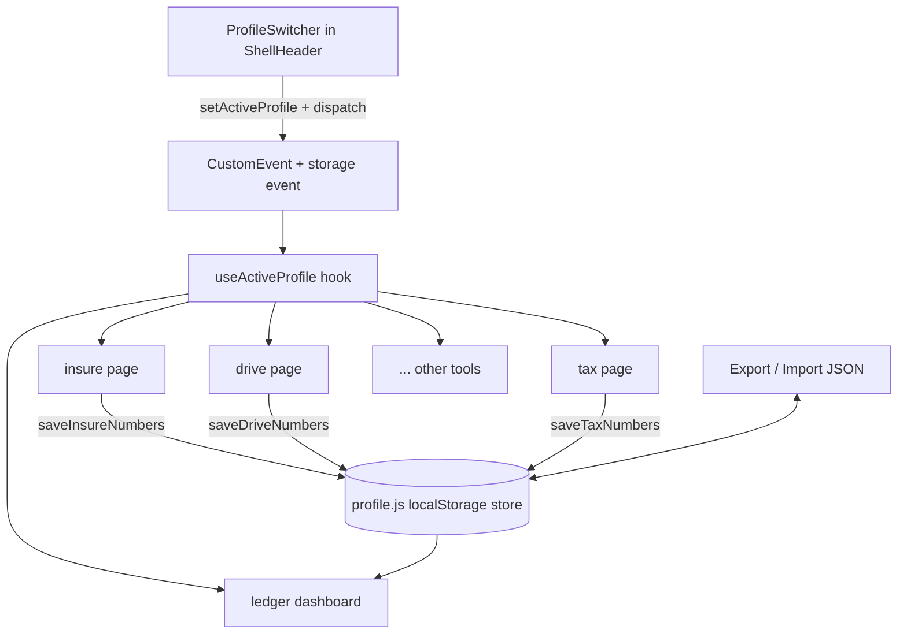
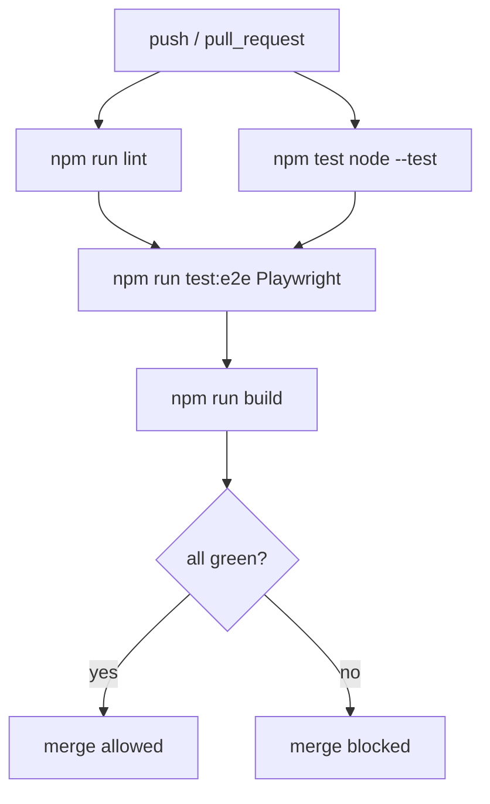

# natdtm: Harden, Connect, Deepen - Plan

Roadmap for taking `natleewhee/natdtm` further as a portfolio / craft piece across three workstreams: harden the eight shipped tools (A), finish the cross-tool profile and dashboard layer (B), and deepen two flagship verticals (D).

This plan stays `requirements-only` until the two launch-blocking questions in Open Questions are resolved. The Planning Contract, Implementation Units, Verification Contract, and Definition of Done are drafted below so the shape is reviewable, but `ce-work` should not execute from them until readiness flips to `implementation-ready`.

---

## Goal Capsule

- **Objective:** A visitor trusts every calculator's number and its "the math" page, moves between the eight tools as one connected product with figures carried across, and a reviewer reading the codebase sees consistent, tested, documented craft.
- **Means:** Three workstreams run against one branch line — A (harden) lands first because B and D build on the shared shell it cleans up; B (connect) and D (deepen) follow and can interleave. (KTD1, KTD2)
- **Authority:** User is product owner. Craft-piece bar: when a decision trades speed against clarity, test coverage, or documentation, choose the latter.
- **Execution profile:** Standard code lifecycle — branch, `npm run lint`, `npm test`, `npm run build`, plus the new CI gate (U1) and Playwright smoke (U4).
- **Stop conditions:** Stop and re-plan if any unit needs a user-data backend, authentication, or a paid API. The product identity is client-side, account-free, keyless (see `.env.example`); Supabase stays a keyless reference-data mirror only.
- **Tail ownership:** Implementer opens one PR per milestone (M1, M2, M3), not one giant PR.

---

## Product Contract

**Product Contract preservation:** bootstrap plan — no upstream Product Contract. Requirements below are derived from the repo state and the user's direction selection (A + D + B, ambition = portfolio / craft piece).

### Summary

natdtm ships eight Singapore money calculators (`insure`, `drive`, `etf`, `house`, `retire`, `tax`, `ledger`, `flow`) in one Next.js 16 app with a shared dark shell, a client-side cross-tool "My Numbers" store, and per-tool methodology pages. The engine layer is well tested (29 `src/lib/**/*.test.js` files); the shell, pages, and profile flows are not. The Coah→ndtm rebrand is unfinished in several shipping surfaces. This plan closes those gaps (A), turns the eight tools into one navigable product by finishing the profile/dashboard layer already stubbed in `src/lib/shared/profile.js` and `/ledger` (B), and adds depth to DriveReady and a Tax×Retire reliefs optimizer (D).

### Problem Frame

The repo has grown from three tools to eight, but three things did not keep pace:

1. **Docs and brand.** `README.md` still describes only three tools. `src/lib/shared/site.js` hardcodes `https://coah.vercel.app` while the live site is `natdtm.vercel.app`, so canonical URLs, `sitemap.js`, `robots.js`, and social images point at the wrong domain. `src/app/page.js` says "Seven calculators" twice but renders eight. `next.config.mjs` comments and the `--l-*` CSS token prefix are Coah/"Ledger" residue, and `--l-` now collides conceptually with the live `/ledger` (MyLedger) vertical.
2. **Test altitude.** Every test is a pure-logic unit test under `src/lib/`. No test exercises a rendered page, a form, a "the math" page, or the profile switch. A regression in the shell or in `profile.js` migration would ship silently. There is no CI workflow that runs `lint` / `test` / `build` — only `.github/workflows/refresh-data.yml` (a data cron).
3. **The product is eight tools, not one.** `src/lib/shared/profile.js` is a 506-line store with a v6 schema, named profiles, and per-tool slots, and `/ledger` is already "the holistic dashboard." But every profile switch calls `window.location.reload()` (`ProfileSwitcher.js` lines 59, 76, 83), there is no cross-tab sync, no profile export/import, and the home page does not surface the connected-ness at all.

### Requirements

#### Trust and consolidation (A)

- R1. CI runs `npm ci`, `npm run lint`, `npm test`, and `npm run build` on every push and pull request, and a failure blocks merge.
- R2. Every shipping brand/URL surface reads `natdtm`: `src/lib/shared/site.js` returns `https://natdtm.vercel.app`; `sitemap.js`, `robots.js`, and any `opengraph-image.js` / `twitter-image.js` derive from that constant; `src/app/page.js` hero copy matches the number of entries in its `TOOLS` array.
- R3. The `--l-*` design tokens are renamed to a single ndtm-namespaced prefix across `src/app/globals.css`, all `src/app/*/legacy.css`, all `src/components/**`, and all inline `style={{}}` usages, with no rendered visual change.
- R4. The eight per-vertical `src/app/*/legacy.css` files are reduced to one shared stylesheet plus only the genuinely per-tool overrides that remain.
- R5. A rendered-output test suite covers: the home page renders all eight tool cards; each tool's landing page and its "the math" page render without error; the profile switch changes the active profile and the numbers a tool shows.
- R6. `src/lib/drive/lta-parse.js` has a test that runs against a committed real LTA Car Cost Update PDF fixture (`/FlateDecode` compressed), not only synthetic input.
- R7. The React Compiler is enabled repo-wide, or a KTD records why a named vertical is excluded.
- R8. The `react-hooks/set-state-in-effect` findings in `src/app/etf/**` and `ProfileSwitcher.js` are either fixed or governed by one documented ESLint override rule instead of scattered inline disables.
- R9. Each of the eight verticals has per-route `generateMetadata` (title, description, canonical) and an `opengraph-image.js`; every "the math" page emits `FAQPage` or `HowTo` JSON-LD.
- R10. `README.md` describes all eight tools; `docs/architecture.md` documents the shell, the profile layer, the DriveReady data pipeline, and the design system.

#### Cross-tool product layer (B)

- R11. Switching, creating, or deleting a profile updates every open tool in the same tab without a full page reload.
- R12. A profile change in one browser tab is reflected in other open tabs of the same site.
- R13. A user can export all profiles to a JSON file and import that file back, with a schema-version check on import.
- R14. The home page surfaces the connected-product model: which tools have saved numbers in the active profile, and a link into `/ledger` when at least one does.
- R15. `/ledger` (MyLedger) shows a one-line headline verdict and figure sourced from each tool that has data in the active profile, and names any tool whose data is stale (via `src/lib/shared/freshness.js`).
- R16. The `profile.js` public API (load / save / clear / profile management) is unchanged for existing call sites, or every changed call site is updated in the same unit.

#### Vertical depth (D)

- R17. DriveReady models electric vehicles: the EV COE category, road tax on power rating, and the absence of an engine-capacity term, with its own "the math" section.
- R18. DriveReady estimates a car-insurance premium range from vehicle value, driver age, and NCD, shown as a range with stated assumptions.
- R19. A reliefs optimizer spanning `/tax` and `/retire` ranks SRS contribution, CPF cash top-up (RSTU), CPF relief, and approved donations by dollars of tax saved per dollar committed, for the current Year of Assessment, reading salary and age from the active profile.
- R20. The reliefs optimizer has its own "the math" page and a pure-logic test suite covering the relief caps and the marginal-rate boundaries.

### Key Decisions

- Ship as three milestone PRs (M1 = A, M2 = B, M3 = D), not one. Governs R1–R20 sequencing.
- Keep the app client-side, account-free, keyless. Governs R11–R16, R19: no server persistence, no auth, no paid data source.
- D goes deep on DriveReady and a Tax×Retire reliefs optimizer, chosen over widening `house`/`etf`/`flow`, because DriveReady is the most-built vertical (11 of 29 test files) and the reliefs optimizer doubles as a showcase of the profile layer from B. Governs R17–R20.

### Scope Boundaries

**Deferred for later**

- Analytics (privacy-friendly or otherwise). Useful for a real-users goal; not for a craft piece.
- Full-site PWA / installable toolkit. Only `etf` has a service worker today; generalizing it is a separate effort.
- A content/blog layer around "the math".
- Promoting Supabase to the store for all SG financial constants (tax brackets, CPF rates, stamp-duty tables). Valuable, but a data-modeling effort of its own; this plan only fixes the `SUPABASE_ANON_KEY` vs `SUPABASE_SERVICE_ROLE_KEY` naming mismatch between `.env.example` and the refresh workflow.
- TypeScript migration. JSDoc types on the money-math engines are in scope only if U-level effort stays small; otherwise deferred.

**Outside this product's identity**

- User accounts, login, server-side profile storage.
- Any data source that needs an API key or a paid plan.
- Personalized financial advice or product recommendations.

### Open Questions

- OQ1. (Blocking) Confirm the D scope: DriveReady depth + Tax×Retire reliefs optimizer, or a different pair of verticals? R17–R20 depend on the answer.
- OQ2. (Blocking) Token rename target: `--ndtm-*`, `--n-*`, or keep `--l-*` and only rewrite the comments and docs? R3 depends on the answer.
- OQ3. (Deferred) Playwright vs `@testing-library/react` + `node:test` for R5. Playwright also gives screenshot snapshots that de-risk R3/R4; `@testing-library` is lighter. Recommend Playwright.
- OQ4. (Deferred) Whether R11's no-reload switch rewires each tool's mount effect, or a lighter shared subscription hook is introduced. Affects U8 size.
- OQ5. (Deferred) Whether the reliefs optimizer lives at a new route or extends `/tax`. Recommend a section on `/tax` that deep-links from `/retire`.

### Success Criteria

- A cold reader of the repo can name all eight tools and find the architecture doc within two minutes.
- `npm run lint` passes with zero inline `eslint-disable` for `react-hooks/set-state-in-effect`.
- CI is green on the default branch and required for merge.
- No shipping surface contains the string `coah` except a one-line note in `docs/architecture.md` explaining the history.
- Switching profiles on `/ledger` updates every card without the page reloading.
- The reliefs optimizer's ranked output matches a hand-worked example in its "the math" page for a stated salary.

### Sources

- `src/lib/shared/profile.js` — 506-line "My Numbers" store, v6 schema, `MAX_PROFILES = 3`, per-tool slots (`house`, `drive`, `retire`, `insure`, `tax`, `etf`, `flow`, `ledger`), `migrateV1`–`migrateV5`, `saveToolInputs` / `loadToolInputs`.
- `src/components/shared/ProfileSwitcher.js:59,76,83` — `window.location.reload()` on switch / delete / create.
- `src/lib/shared/site.js:1` — `SITE_URL = 'https://coah.vercel.app'`.
- `src/app/page.js:54,67` — "Seven calculators" copy vs 8-entry `TOOLS` array; product names InsureCheck, DriveReady, WhatETF, HouseMuch, RetireWell, TaxWise, MyLedger, FlowState.
- `next.config.mjs` — build-time version stamping, self-only CSP with `script-src 'self' 'unsafe-inline' 'unsafe-eval'`, "coah" in comments.
- `eslint.config.mjs` — bare `eslint-config-next/core-web-vitals`, no custom rules.
- `.github/workflows/refresh-data.yml` — the only workflow; Node 22; `peter-evans/create-pull-request@v6`; references `secrets.SUPABASE_SERVICE_ROLE_KEY`.
- `.env.example` — names `SUPABASE_ANON_KEY` (mismatch with the workflow's `SUPABASE_SERVICE_ROLE_KEY`).
- `git ls-files 'src/**/*.test.js'` — 29 files, all under `src/lib/`; none under `src/app/` or `src/components/`.
- `README.md` "Known Limitations" — React Compiler only on original InsureCheck; etf `react-hooks/set-state-in-effect` debt; LTA PDF path unverified against a live PDF.
- `src/app/*/legacy.css` — eight per-vertical stylesheets; `src/lib/*/theme.js` and `src/components/*/ui.js` repeated per vertical.

---

## Planning Contract

### Key Technical Decisions

- KTD1. **One branch line, three milestone PRs.** M1 (A) merges before M2 (B) and M3 (D) start, because R3/R4 (token rename, CSS consolidation) and R1 (CI) change the surfaces B and D build on. Rationale: rebasing B and D over a token rename is worse than sequencing. Cites Goal Capsule Means.
- KTD2. **A before B/D; B and D interleave.** After M1, B and D touch mostly disjoint files (`profile.js` / shell vs `src/lib/drive` + `src/lib/tax`), so they need no strict order. Cites Goal Capsule Means.
- KTD3. **CI via GitHub Actions, Node 22, matching `refresh-data.yml`.** One workflow `.github/workflows/ci.yml`: `npm ci && npm run lint && npm test && npm run build` on `push` and `pull_request`. Adds a `test:e2e` job (U4) gated to run after the unit job. Governs R1.
- KTD4. **Playwright for rendered-output and cross-tool tests; keep `node --test` for pure logic.** Playwright is the standard Next.js e2e path, runs the real shell, and its screenshot snapshots de-risk the R3/R4 token rename and CSS consolidation. `node --test` stays the engine-layer tool. Governs R5, R6, R20. (Pending OQ3.)
- KTD5. **Token rename by codemod in one commit, snapshots captured first.** Capture Playwright screenshot baselines of every landing page and "the math" page, run a scripted find-replace `--l-` → chosen prefix across `src/**` and `src/app/**/*.css`, then diff snapshots to prove zero visual change. Governs R3. (Prefix pending OQ2.)
- KTD6. **Profile change broadcasts via a `storage` event plus a same-tab `CustomEvent`; tools subscribe through one shared hook.** Add `src/lib/shared/useActiveProfile.js` (or extend an existing hook): it returns the active profile id and re-runs its subscribers on change. `ProfileSwitcher` dispatches instead of calling `window.location.reload()`. `storage` events already fire cross-tab for free, covering R12. Governs R11, R12. (U8 size pending OQ4.)
- KTD7. **`profile.js` public API is frozen; only `ProfileSwitcher` and the new hook change.** Every `saveXNumbers` / `loadMyNumbers` / profile-management export keeps its signature. Export/import (R13) is two new exports (`exportProfiles`, `importProfiles`) plus a UI affordance, not a schema change. Governs R13, R16.
- KTD8. **Reliefs optimizer is a pure module `src/lib/tax/reliefs.js` consumed by a section on `/tax`, deep-linked from `/retire`.** It imports the existing `src/lib/shared/tieredTax.js` for marginal rates and `src/lib/retire/srs.js` / `src/lib/retire/cpf.js` for caps. No new route. Governs R19, R20. (Placement pending OQ5.)
- KTD9. **EV modelling extends `src/lib/drive/calc.js` / `tco.js` with a `powertrain` field; no schema break.** Road tax becomes a function of `powertrain` (`ice` | `ev` | `hybrid`) and either engine capacity or power rating. Existing callers default to `ice`. Governs R17.
- KTD10. **README stays hand-maintained; a test asserts the tool count.** A `node --test` case reads the `TOOLS` array length from `src/app/page.js` (or a shared `src/lib/shared/tools.js` it is refactored into) and asserts the hero copy's number word matches. Prevents R2's "Seven"/"eight" drift from recurring. Governs R2, R10.

### High-Level Technical Design

The cross-tool profile layer after B:

CI and verification pipeline after A:

### Assumptions

- Vercel deploy config (`vercel.json`) needs no change; CI is additive.
- The live site URL is `https://natdtm.vercel.app` (repo homepage field). Confirm before R2 lands.
- A real LTA Car Cost Update PDF can be committed as a test fixture (public document, no licensing bar).
- `MAX_PROFILES = 3` stays; export/import does not raise the cap.
- Next.js 16 + React 19 React Compiler is stable enough to enable repo-wide (it is already on one vertical).

### Sequencing

1. M1 / A: U1 (CI) → U2 (brand/URL) → U4 (Playwright harness + smoke) → U3 (token rename + CSS consolidation) → U5 (LTA PDF fixture) → U6 (React Compiler + lint debt) → U7 (SEO metadata + JSON-LD) → U10 (docs). U4 depends on U1; U3 depends on U4's snapshot baseline.
2. M2 / B: U8 (no-reload switch + cross-tab) → U9 (export/import) → U11 (home connected-state) → U12 (ledger headline verdicts). U11/U12 depend on U8.
3. M3 / D: U13 (DriveReady EV) → U14 (DriveReady insurance range) → U15 (reliefs optimizer logic) → U16 (reliefs optimizer UI + the-math). U15 before U16.

---

## Implementation Units

### Unit Index

| U-ID | Title | Files touched | Depends on |
|---|---|---|---|
| U1 | CI workflow | `.github/workflows/ci.yml` | — |
| U2 | Brand + URL correctness | `src/lib/shared/site.js`, `src/app/sitemap.js`, `src/app/robots.js`, `src/app/page.js`, `next.config.mjs` | — |
| U3 | Token rename + CSS consolidation | `src/app/globals.css`, `src/app/*/legacy.css`, `src/components/**`, `src/app/**` inline styles | U4 |
| U4 | Playwright harness + page smoke | `playwright.config.js`, `e2e/**`, `package.json` | U1 |
| U5 | Live LTA PDF fixture test | `src/lib/drive/lta-parse.test.js`, `src/lib/drive/__fixtures__/` | — |
| U6 | React Compiler repo-wide + lint debt | `next.config.mjs`, `eslint.config.mjs`, `src/app/etf/**`, `src/components/shared/ProfileSwitcher.js` | U4 |
| U7 | Per-route metadata + JSON-LD | `src/app/*/layout.js`, `src/app/*/opengraph-image.js`, `src/app/*/the-math/page.js` | U2 |
| U8 | No-reload profile switch + cross-tab | `src/lib/shared/useActiveProfile.js`, `src/components/shared/ProfileSwitcher.js`, each `src/app/*/page.js` | U4 |
| U9 | Profile export / import | `src/lib/shared/profile.js`, `src/components/shared/ProfileSwitcher.js` | U8 |
| U10 | Docs rewrite | `README.md`, `docs/architecture.md`, `src/lib/shared/tools.js` | U2 |
| U11 | Home connected-state | `src/app/page.js`, `src/lib/shared/tools.js` | U8 |
| U12 | Ledger headline verdicts | `src/app/ledger/page.js`, `src/components/ledger/**`, `src/lib/ledger/calc.js` | U8 |
| U13 | DriveReady EV model | `src/lib/drive/calc.js`, `src/lib/drive/tco.js`, `src/app/drive/the-math/page.js` | — |
| U14 | DriveReady insurance range | `src/lib/drive/insurance.js`, `src/components/drive/ResultPanel.js` | — |
| U15 | Reliefs optimizer logic | `src/lib/tax/reliefs.js`, `src/lib/tax/reliefs.test.js` | — |
| U16 | Reliefs optimizer UI + the-math | `src/app/tax/page.js`, `src/app/tax/the-math/page.js`, `src/app/retire/page.js` | U15 |

### M1 — Harden (A)

### U1. CI workflow

- **Goal:** `lint`, `test`, `build` run on every push and PR and block merge on failure (R1).
- **Files:** `.github/workflows/ci.yml` (new).
- **Approach:** Mirror `refresh-data.yml` setup (checkout, `actions/setup-node@v4` Node 22, `cache: npm`). Job `unit`: `npm ci` → `npm run lint` → `npm test`. Job `build`: needs `unit`, runs `npm run build`. Add `e2e` job after U4 exists. Enable branch protection requiring these checks.
- **Test scenarios:** PR with a failing `node --test` case shows a red required check. PR with a lint error shows red. Clean PR shows all green.
- **Verification:** Push the branch; observe checks in the PR.

### U2. Brand and URL correctness

- **Goal:** No shipping surface says `coah` or "Seven calculators" (R2).
- **Files:** `src/lib/shared/site.js`, `src/app/sitemap.js`, `src/app/robots.js`, `src/app/page.js`, `src/app/insure/opengraph-image.js`, `src/app/insure/twitter-image.js`, `next.config.mjs` comments.
- **Approach:** Set `SITE_URL = 'https://natdtm.vercel.app'`. Grep `coah` across the repo and fix every hit. Replace both "Seven calculators" strings in `page.js` with a value derived from `TOOLS.length` (or the `tools.js` module from U10). Confirm `sitemap.js` / `robots.js` build their URLs from `SITE_URL`.
- **Test scenarios:** `rg -i coah src/` returns nothing. `curl` of the built `/sitemap.xml` shows `natdtm.vercel.app`. Home hero number word equals `TOOLS.length`.
- **Verification:** `npm run build`; inspect `.next` output for the sitemap; visual check of the home page.

### U3. Token rename and CSS consolidation

- **Goal:** One namespaced token prefix and one shared stylesheet, zero visual change (R3, R4).
- **Files:** `src/app/globals.css`, all `src/app/*/legacy.css`, `src/components/**/*.css` and `*.module.css`, every inline `style={{}}` referencing `var(--l-...)`.
- **Approach:** With U4 snapshots as the baseline: scripted replace `--l-` → chosen prefix (OQ2) across `src/**`. Then move the rules common to all eight `legacy.css` files into `globals.css`; keep only the per-tool deltas, renamed `src/app/<tool>/<tool>.css`. Delete emptied `legacy.css` files.
- **Test scenarios:** Playwright screenshot diff of all 16+ pages shows no pixel change. `rg -- '--l-' src/` returns nothing. `npm run build` succeeds.
- **Verification:** `npm run test:e2e -- --update-snapshots=none`; review the diff report.

### U4. Playwright harness and page smoke

- **Goal:** Rendered-output tests exist for the home page, every landing page, every "the math" page (R5).
- **Files:** `playwright.config.js` (new), `e2e/smoke.spec.js` (new), `e2e/profile.spec.js` (new), `package.json` (`test:e2e` script, dep).
- **Approach:** Config runs against `npm run build && npm run start` on a fixed port. `smoke.spec.js`: for each of the eight tools, assert the landing page and `/{tool}/the-math` return 200 and render a known heading; assert the home page renders eight tool cards. `profile.spec.js`: create a profile, enter a number in one tool, switch profile, assert the number is gone, switch back, assert it returns. Capture screenshot baselines for U3.
- **Test scenarios:** All smoke specs pass on a clean build. Deleting a tool card from `page.js` fails the "eight cards" assertion.
- **Verification:** `npm run test:e2e`.

### U5. Live LTA PDF fixture test

- **Goal:** `extractPdfText` is proven against a real `/FlateDecode` PDF (R6).
- **Files:** `src/lib/drive/lta-parse.test.js`, `src/lib/drive/__fixtures__/lta-car-cost-update.pdf` (new).
- **Approach:** Commit one real LTA Car Cost Update PDF. Add a test that runs `extractPdfText` on it and asserts a known make/model/price row parses, plus the coverage sanity check (`isLowCoverage`) passes.
- **Test scenarios:** Parser extracts the expected row from the real PDF. A truncated copy of the PDF trips `isLowCoverage`.
- **Verification:** `npm test`.

### U6. React Compiler repo-wide and lint debt

- **Goal:** React Compiler on for all verticals; no scattered `eslint-disable` for `react-hooks/set-state-in-effect` (R7, R8).
- **Files:** `next.config.mjs`, `eslint.config.mjs`, `src/app/etf/**`, `src/components/shared/ProfileSwitcher.js`.
- **Approach:** Enable the compiler globally in `next.config.mjs`. Fix the `set-state-in-effect` findings (the `ProfileSwitcher` mount read becomes a `useSyncExternalStore` or lazy initializer via the U8 hook). If a genuine case remains, add one rule config in `eslint.config.mjs` with a comment, and remove the inline disables. If a vertical cannot compile cleanly, record it in a KTD and exclude it explicitly.
- **Test scenarios:** `npm run lint` passes with zero inline disables for that rule. `npm run test:e2e` still green. `npm run build` shows the compiler active.
- **Verification:** `npm run lint && npm run build && npm run test:e2e`.

### U7. Per-route metadata and JSON-LD

- **Goal:** Every vertical has metadata + an OG image; every "the math" page emits structured data (R9).
- **Files:** each `src/app/<tool>/layout.js` (or `page.js` `metadata` export), each `src/app/<tool>/opengraph-image.js` (new, seven of eight), each `src/app/<tool>/the-math/page.js`.
- **Approach:** Factor the `insure` OG image into a shared generator taking title + eyebrow, reused by all eight. Add `generateMetadata` per route with canonical from `SITE_URL`. Add a small `<script type="application/ld+json">` (`FAQPage` for Q&A-shaped math pages, `HowTo` for step-shaped ones).
- **Test scenarios:** Each `/{tool}` build output has a distinct `<title>` and `og:image`. Each math page's JSON-LD validates against schema.org shape in a unit test.
- **Verification:** `npm run build`; a `node --test` case asserts the JSON-LD blocks parse and carry required keys.

### U10. Docs rewrite

- **Goal:** README covers eight tools; an architecture doc exists (R10).
- **Files:** `README.md`, `docs/architecture.md` (new), `src/lib/shared/tools.js` (new — the `TOOLS` array extracted for reuse by `page.js`, tests, and docs).
- **Approach:** Rewrite README around the eight tools and the shell. `docs/architecture.md`: the `ShellHeader` / `Footer` shell, `profile.js` store and schema history, the DriveReady data pipeline (`scripts/` + `refresh-data.yml` + Supabase mirror), the design system and token prefix, the "the math" page convention. One line noting the Coah history.
- **Test scenarios:** README tool list length equals `tools.js` length (asserted in a test). No `coah` outside the history note.
- **Verification:** `npm test`; manual read.

### M2 — Connect (B)

### U8. No-reload profile switch and cross-tab sync

- **Goal:** Profile changes update open tools in-place and across tabs (R11, R12, R16).
- **Files:** `src/lib/shared/useActiveProfile.js` (new), `src/components/shared/ProfileSwitcher.js`, each `src/app/<tool>/page.js` that reads `loadMyNumbers()` on mount.
- **Approach:** New hook built on `useSyncExternalStore`: subscribes to `window` `storage` events and a same-tab `ndtm:profile-change` `CustomEvent`; snapshot is `getActiveProfileId()`. `ProfileSwitcher` calls `setActiveProfile` then dispatches the event — no `window.location.reload()`. Each tool page keys its "load my numbers" effect on the hook's value so it re-reads on change. Keep `profile.js` API frozen (KTD7).
- **Test scenarios:** `e2e/profile.spec.js`: switch profile on `/ledger`, every card updates, no navigation. Two-tab test: change in tab A reflects in tab B. Existing per-tool save/load still works.
- **Verification:** `npm run test:e2e`.

### U9. Profile export / import

- **Goal:** Round-trip all profiles through a JSON file (R13).
- **Files:** `src/lib/shared/profile.js` (add `exportProfiles`, `importProfiles`), `src/components/shared/ProfileSwitcher.js` (menu affordance).
- **Approach:** `exportProfiles()` returns the raw wrapper store as a pretty JSON string with a `schemaVersion`. `importProfiles(text)` parses, validates `schemaVersion` and shape, runs the existing `migrateInnerData` per profile, and replaces the store (respecting `MAX_PROFILES`, truncating with a warning). UI: a download button and a file input in the profile menu.
- **Test scenarios:** Export then import yields an identical store. Importing a v1-era flat payload migrates it. Importing malformed JSON shows an error and leaves the store untouched. Importing 5 profiles keeps 3 and warns.
- **Verification:** `npm test` (new `profile.test.js` cases) + a Playwright case for the download/upload affordance.

### U11. Home connected-state

- **Goal:** The home page shows the product is connected (R14).
- **Files:** `src/app/page.js`, `src/lib/shared/tools.js`.
- **Approach:** Client component reads `loadMyNumbers()` for the active profile; each tool card shows a subtle "saved" marker when its slot has data; a "See your whole picture in MyLedger" link appears when at least one slot is filled. SSR-safe: render the plain grid first, enrich after mount.
- **Test scenarios:** With no data, cards look as today, no ledger link. After saving numbers in two tools, those two cards show the marker and the ledger link appears. No hydration warning.
- **Verification:** `npm run test:e2e`.

### U12. Ledger headline verdicts

- **Goal:** `/ledger` shows one verdict + figure per tool with data, and flags stale data (R15).
- **Files:** `src/app/ledger/page.js`, `src/components/ledger/**`, `src/lib/ledger/calc.js`.
- **Approach:** For each populated slot, compute a one-line verdict from that tool's own logic module (reuse, do not re-derive) and a headline figure. Use `src/lib/shared/freshness.js` to mark a slot stale past its threshold. Order by "needs attention" first.
- **Test scenarios:** `ledger/calc.test.js`: given a fixture profile with drive + tax + retire data, the verdicts and figures match expected. A slot with an old `savedAt` renders as stale.
- **Verification:** `npm test` + a Playwright render check.

### M3 — Deepen (D)

### U13. DriveReady EV model

- **Goal:** EVs are modelled correctly end to end (R17).
- **Files:** `src/lib/drive/calc.js`, `src/lib/drive/tco.js`, `src/lib/drive/calc.test.js`, `src/lib/drive/tco.test.js`, `src/app/drive/the-math/page.js`, `src/components/drive/UsedCarForm.js` / `CarPicker.js` (powertrain input).
- **Approach:** Add `powertrain: 'ice' | 'ev' | 'hybrid'`, defaulting to `ice` for all existing callers (KTD9). Road tax: power-rating formula for EV/hybrid, engine-capacity formula for ICE. Drop the engine-capacity term from the EV path. Add an EV section to the "the math" page.
- **Test scenarios:** Road tax for a stated EV kW matches the LTA schedule. An ICE car's result is unchanged from the pre-U13 snapshot. A hybrid uses the power-based path.
- **Verification:** `npm test`.

### U14. DriveReady insurance range

- **Goal:** A premium range with stated assumptions (R18).
- **Files:** `src/lib/drive/insurance.js` (new), `src/lib/drive/insurance.test.js` (new), `src/components/drive/ResultPanel.js`.
- **Approach:** Pure function of car value, driver age band, and NCD band → low/high annual premium using published market rate-of-value bands. Show as a range with a visible "assumptions" note; feed the midpoint into TCO as an optional line.
- **Test scenarios:** A 35-year-old with 50% NCD on a stated car value gets a range whose bounds match the rate bands. A young driver band widens the range. Zero NCD raises both bounds.
- **Verification:** `npm test`.

### U15. Reliefs optimizer logic

- **Goal:** Rank reliefs by tax saved per dollar committed for the current YA (R19).
- **Files:** `src/lib/tax/reliefs.js` (new), `src/lib/tax/reliefs.test.js` (new).
- **Approach:** Input: assessable income, age, existing reliefs, cash available. For SRS, RSTU (CPF cash top-up), CPF relief, and approved donations, compute marginal tax saved for the next dollar and the cap remaining, using `src/lib/shared/tieredTax.js` for the bracket and `src/lib/retire/srs.js` / `cpf.js` for caps. Output an ordered list with `reliefType`, `capRemaining`, `marginalRateAtEntry`, `taxSavedIfMaxed`, `ratio`. Handle the bracket crossing when a contribution drops income into a lower band.
- **Test scenarios:** At a stated income in the 15% band, SRS ranks above donations (donations give 250% deduction but the worked case shows the ratio order). Contribution that crosses a bracket boundary uses the blended rate. Age 55+ raises the SRS cap. A fully-used relief drops out of the ranking.
- **Verification:** `npm test`.

### U16. Reliefs optimizer UI and the-math

- **Goal:** The optimizer is usable and explained (R20).
- **Files:** `src/app/tax/page.js`, `src/app/tax/the-math/page.js`, `src/app/retire/page.js` (deep link), `src/components/tax/Results.js`.
- **Approach:** A section on `/tax` (KTD8, pending OQ5) that reads salary + age from the active profile, shows the ranked table from U15, and links to `/tax/the-math#reliefs`. `/retire` gets a "See which reliefs pay you back most" link into it. The "the math" page carries a full hand-worked example matching a stated salary.
- **Test scenarios:** With profile data present, the section pre-fills. The ranked table matches the "the math" worked example for that salary. Changing age to 55+ reorders the table.
- **Verification:** `npm run test:e2e` + `npm test`.

---

## Verification Contract

| Gate | Command | Applies to | Done signal |
|---|---|---|---|
| Lint | `npm run lint` | all units | zero errors, zero inline `set-state-in-effect` disables after U6 |
| Unit | `npm test` (`node --test`) | U2, U5, U7, U9, U10, U12, U13, U14, U15, U16 | all pass |
| E2E | `npm run test:e2e` (Playwright) | U3, U4, U6, U8, U9, U11, U12, U16 | all specs pass; U3 screenshot diff empty |
| Build | `npm run build` | all units | succeeds; sitemap shows `natdtm.vercel.app` |
| CI | `.github/workflows/ci.yml` | M1 onward | required checks green on the PR |

- No `release:validate` equivalent exists in this repo; the four gates above plus CI are the release bar.
- U3 exit criterion is quantitative: Playwright screenshot diff of every landing and "the math" page is zero.

---

## Definition of Done

**Global**

- All four verification gates green in CI on each milestone PR.
- `rg -i coah src/` returns nothing; `rg -- '--l-' src/` returns nothing.
- `README.md` lists eight tools; `docs/architecture.md` exists and covers the shell, profile layer, data pipeline, design system.
- No abandoned or dead-end code left in the diff; deleted `legacy.css` files actually removed, not emptied.
- `profile.js` public API unchanged, or every changed call site updated in the same unit.

**Per milestone**

- M1 (A): CI required for merge; token rename proven visually neutral; Playwright smoke covers all 16+ pages; LTA PDF fixture test passes; React Compiler on repo-wide or exclusion documented; every vertical has metadata + OG image.
- M2 (B): profile switch causes no page reload and syncs across tabs; export/import round-trips and migrates old payloads; home page shows connected-state; `/ledger` shows per-tool verdicts with stale flags.
- M3 (D): DriveReady models EV road tax and shows an insurance range, both with "the math" coverage; reliefs optimizer ranks four reliefs for the current YA, reads the active profile, and matches its worked example.

**Readiness flip:** resolve OQ1 and OQ2, then set `artifact_readiness: implementation-ready`.

---

## Review findings and scope decision (2026-08-30 review)

This block is the output of a `ce-doc-review` pass plus a scope decision by the owner. The plan body above is **not yet rewritten** to match it — do that before flipping to `implementation-ready`.

### Scope decision — narrow the roadmap

The A + D + B breadth was judged too wide for a solo portfolio / craft piece (6 reviewers converged: broad-but-not-exceptional risk). New scope:

- **Keep:** M1 (harden) as the spine + **DriveReady** taken to exceptional depth as the one showpiece vertical.
- **Defer to a later plan:** all of M2 / B (cross-tool profile layer — no-reload switch, cross-tab sync, export/import, home connected-state, MyLedger verdicts; R11–R16, U8–U12) and the Tax×Retire reliefs optimizer (R19, R20, U15, U16, KTD8).
- **Drop from M1:** R3 / U3 token codemod (keep only R4 CSS consolidation, with its own screenshot check); R7 / repo-wide React Compiler (keep only R8 lint-debt cleanup); U7 / R9 SEO metadata + JSON-LD + OG images (optionally keep a plain per-route `title`/`description`).
- **Add to M1:** a correctness-and-currency audit unit — verify every embedded SG rate / bracket / cap in the eight engines against its 2026 authoritative source (IRAS / CPF / LTA) with a dated `_AS_OF` citation per constant; add golden-master tests per engine against published figures; a stale constant fails CI. New Success Criterion: "every embedded statutory constant is current for its stated Year of Assessment." This replaces "trust" resting on render-smoke tests.

OQ1 resolves to DriveReady-only (no reliefs optimizer this plan). OQ2 resolves to "keep `--l-*`, fix comments/docs only".

### Factual corrections to fold in on rewrite

- **U13 / U14 / KTD9 — do not rebuild what exists.** `src/lib/drive/tco.js` already ships `estimateRoadTax(omv, pureEV)` with `ROAD_TAX_BANDS_ICE` / `ROAD_TAX_BANDS_EV`, `estimateInsurance(omv, pureEV)` with `INSURANCE_BANDS` + an EV loading, and `isPureEV(car)` (from `calc.js`), all tested in `tco.test.js` and wired into `estimateAnnualRunningCosts`. Rewrite U13/U14 to modify those functions and route powertrain through the existing `isPureEV` / `car.type` mechanism (extend to `hybrid` if needed). Do not add a parallel `powertrain` enum or a new `src/lib/drive/insurance.js`.
- **R17 has no data source for power-rating road tax or the EV COE category.** The codebase has no kW/cc data; `cars.json` is refreshed from a parser that extracts price/OMV/VES rows only, and `tco.js` approximates road tax by OMV band for exactly this reason. Either source and commit a kW dataset for EV models, or rescope R17 to an OMV-band EV schedule and state that COE-category-by-power is out of scope. U13 currently also omits any approach step or test for the EV COE category, which R17 names.
- **R4 / U3 / Sources — `legacy.css` inventory is wrong.** Only three exist: `src/app/drive/legacy.css`, `src/app/etf/legacy.css`, `src/app/insure/legacy.css`. The other five verticals carry styling as JS style objects in `src/lib/<tool>/theme.js` + `src/components/<tool>/ui.js`, which also embed `--l-*` tokens and hex mirrors as string literals — that duplication is the real consolidation target.
- **U2 / R2 — `coah` de-brand is ~56 files, not seven.** It is in CSS class names (`coah-button`, `coah-button--<variant>` from `src/components/shared/Button.js`; `coah-scroll` in `CarPicker`), CSS custom properties (`--color-coah`, `--font-coah`), theme keys (`C.coah` / `coahMid` / `coahLight` / `fontCoah` across every `src/lib/<tool>/theme.js`), and user-visible strings (`coah.sg` in `PrintSummary.jsx`, a literal "coah / invest" label in `ResultPanel.js`). Class/variable renames carry the same regression risk as R3 and need the same screenshot baseline.
- **U2 — "Seven calculators" is one occurrence at `src/app/page.js:63`,** not two at lines 54/67. Fix the count and line reference in Problem Frame, Sources, and U2's approach.
- **U1 / KTD3 — CI e2e job needs `npx playwright install --with-deps`** (cache `~/.cache/ms-playwright`), then build, then serve, before `npm run test:e2e`. Without it every run fails on a missing browser.
- **HTD CI diagram contradicts the prose.** The mermaid wires `unit → e2e → build → gate`; KTD3/U1 say `build` needs `unit` and `e2e` is a sibling job off `unit`. Redraw: `unit → build`, `unit → e2e`, `lint → e2e`, both `build` and `e2e` → `gate`.
- **Site URL is load-bearing and unconfirmed.** Promote "confirm `https://natdtm.vercel.app` is the canonical domain" to a blocking Open Question on the readiness-flip checklist; R2 writes it into `site.js`, sitemap, robots, and OG images.
- **Supabase key-name fix is in scope but owned by no unit** — and may not be a real mismatch (`.env.example` documents both `SUPABASE_ANON_KEY` and `SUPABASE_SERVICE_ROLE_KEY`; `refresh-data.yml` uses the latter, which is present). Verify it is real; if so, give `.env.example` / `refresh-data.yml` to U1 and add a DoD check; otherwise move the item to "Deferred for later".
- **U6 lint fix must use its standalone path.** With M2 deferred, `src/lib/shared/useActiveProfile.js` does not exist, so the `ProfileSwitcher` `set-state-in-effect` fix must be a lazy initializer / `useSyncExternalStore` against `profile.js` directly, plus one documented ESLint override rule replacing the scattered inline disables.
- **KTD10 is redundant and brittle.** U2's own approach derives the hero copy from `TOOLS.length`, which makes "Seven"/"eight" drift impossible; a `node --test` case that regex-parses an array length out of JSX is more likely to false-fail. Drop KTD10; if a guard is wanted, assert the rendered home-page text in Playwright smoke.
- **KTD5 "zero screenshot diff" is unachievable** even for the retained R4 consolidation — the footer build-version stamp and CI-vs-baseline font rendering guarantee a non-zero diff. Use a pixel/ratio tolerance with masked regions for the version stamp; pin the screenshot runner to the CI image; state the tolerance in the Verification Contract. Update the DoD line `rg -- '--l-' src/ returns nothing` (no longer true once R3 is dropped).

### Open decisions still to settle on rewrite

- **DriveReady depth needs UI specs:** powertrain input control type and what happens to the engine-capacity field when EV is selected (segmented control, hide vs disable); insurance range presentation (always-visible assumptions caption; TCO "optional line" — default included or excluded, user toggle or not).
- **Accessibility:** no unit carries a keyboard-nav / focus / ARIA spec and the Verification Contract has no a11y gate — a gap on exactly the surfaces this plan touches, against the craft-piece bar. Add an a11y line to the DriveReady UI units and a keyboard-path assertion to the E2E gate.
- **"Consistent craft" (objective clause 3) has no requirement.** Add an A-workstream code-consistency pass: one documented module layout applied to all eight verticals, shared `theme` / `ui` factored out, JSDoc completed on every exported engine function — or narrow the objective.
- **LTA PDF fixture (R6 / U5):** confirm the LTA publication licence permits redistribution in a public repo before committing a real PDF; if not, generate a `/FlateDecode`-compressed fixture mirroring the layout. Target the assertion at structural parse success + `isLowCoverage`, not a specific price (LTA revises fortnightly).
- **Branch protection** (R1 "a failure blocks merge") is a repo-admin action outside any PR; give a unit or DoD item the job of verifying it is enforced.

### FYI / residual

- `next.config.mjs` ships a self-only CSP with `'unsafe-inline'` and `'unsafe-eval'` — visible to a code reviewer, currently out of scope.
- The Unit Index "Files touched" cells are deliberately abbreviated but omit collision-relevant files (U13's `UsedCarForm.js` / `CarPicker.js`); worth adding on rewrite.
- The portfolio audience (who reviews the repo, against what bar) is never characterised — the payoff of any version of this plan is unmeasurable without it.
