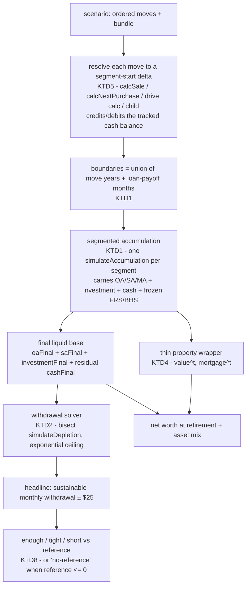

# Scenario Planner (MyLedger rebuild) - Plan

## Goal Capsule

- **Objective:** A Singapore person weighing a major asset move — sell a flat, buy a condo, shift cash between property and investments, take on a car, have a child — can lay those moves out as a dated sequence and see how the sequence plays out over time against doing nothing: whether each future still leaves enough to live on, and how far the answer shifts under a bad-case set of assumptions.
- **Means:** Rebuild `/ledger` (MyLedger) as a timed-scenario planner that drives RetireWell's existing projection engine (`src/lib/retire/calc.js`) in per-event segments. (session-settled — see Key Decisions)
- **Product authority:** The user is the product owner. The eight-tool, client-side, account-free, keyless identity holds; nothing here needs a backend or a paid data source.
- **Open blockers:** None. The planning-deferred items and the doc-review findings are resolved in this document (see Outstanding Questions → Resolved). Segment-stitching correctness stays the load-bearing *implementation* risk — U1 is the characterization-first gate that must pass before U2–U6 are built.

---

## Product Contract

**Product Contract preservation:** restructured, no scope change. R9's phrase "from RetireWell's own retirement-target logic" is refined — RetireWell exposes no sustainable-withdrawal scalar (`desiredMonthlyWithdrawal` is an input), so the figure is solved by bisection over `simulateDepletion` (see KTD2). All R/F/AE IDs and KD1–KD5 unchanged.

### Summary

Rebuild MyLedger from a single-point net-worth-and-TDSR dashboard into a timed-scenario planner. A scenario is an ordered list of dated life-event moves; the planner projects finances forward by running RetireWell's engine in segments — split at each move's year *and* at each loan-payoff month — carrying balances across each boundary. Scenarios sit side by side against a "do nothing" baseline, each showing a sustainable-monthly-withdrawal headline read as *comfortably enough / tight / short* (shortened to *enough / tight / short* elsewhere in this document — same three labels), across three editable assumption bundles.

### Problem Frame

Every natdtm tool resolves one decision in isolation. HouseMuch tells you what a sale nets; RetireWell projects a fixed contribution stream; DriveReady prices a car; MyLedger shows today's net worth and a one-shot retirement outcome. Nothing shows the cascade a real move sets off: sell the flat, buy the condo, top up the purchase from personal savings, and the investment portfolio shrinks — which changes the asset mix, which changes the forward return, which changes retirement adequacy, which is exactly the number the decision turns on. The user is facing this move now and has to reason across four tools by hand, with no way to compare "sell vs don't", "upgrade now vs in year 8", or "+car vs not" on one screen.

MyLedger already reaches for this — `calcScenarioRetirement` collapses a loan-tenure-aware capacity schedule into one flat contribution and hands it to RetireWell (`src/lib/ledger/calc.js:327`). But its scenarios are resolved static ledger states, not timelines: the only time-variation is loan payoff at tenure endpoints. A move that happens in year 4 cannot be expressed.

<!-- ce-section: work-relationships -->
### How this work fits together

This plan owns one area: the **cross-tool scenario engine** — the timed-move model, the segmented projection, and the `/ledger` rebuild that surfaces it. The broader "make the eight tools feel like one product" idea has two other areas that came up in dialogue; the breakdown below is the current understanding, not a committed roadmap.

- **Guided path through the tools** — a recommended order to work through the eight calculators, progress tracking, a "start here". *Can proceed independently of* this plan; it is onboarding and sequencing, not modelling. A later brainstorm owns it.
- **Deeper cross-tool data flow** — one number edited anywhere propagating everywhere. *Partly shipped already* (the profile-store and no-reload-switch work) and *enables* this plan: the scenario engine reads every move's effect from the tool that owns it and persists to the shared profile. What remains of this area is folded into this plan's Requirements (R3, R16), not tracked separately.

### Key Decisions

- KD1. **Reuse RetireWell's engine in segments; do not fork it.** The scenario layer projects to each boundary, reads the balances, and restarts RetireWell's accumulation with the new contribution rate and starting balances — stitching segments together. No behaviour change for existing `/retire` callers, so the two surfaces never diverge. (session-settled: user-directed — chosen over adding a piecewise `investmentMonthly` schedule to RetireWell itself, and over a new lightweight standalone model: keeps the shared engine single-source and full-fidelity.) **Refinement from doc review (2026-09-02):** "untouched" is narrowed to *no behaviour change for existing callers*. `simulateAccumulation` gains **one backward-compatible optional parameter** — an injected `{ frozenFRS, frozenBHS }` pair (and it returns the pair it computed) — so a segment that begins after age 55 or 65 continues the prior segment's frozen cohort sums instead of re-deriving a higher prevailing figure from its later start year. Existing callers pass nothing and behave identically; a characterization test in U1 pins that. Governs R4, R5, R6.
- KD2. **Rebuild `/ledger` around the planner; the current lightweight dashboard is replaced.** The scenario planner is the primary surface. The bare net-worth figure and TDSR-across-loans view are kept as secondary reads, not a separate mode or route. (session-settled: user-directed — chosen over a new `/plan` route and over a tab inside the current dashboard: one holistic surface, no "which page do I use".) Governs R13, R14.
- KD3. **Property is a thin wrapper on the projection.** RetireWell projects the liquid side (CPF, SRS, investments, safe-withdrawal-rate adequacy). A thin layer adds property value compounding at its own appreciation rate, plus mortgage pay-down, for the net-worth line and the asset-mix chart only. Whether a scenario is "enough" is judged on liquid assets alone. (session-settled: user-approved — chosen over folding projected property equity into the sustainable-withdrawal calc, and over holding property flat: the conservative read, so a paper-rich cash-poor scenario cannot look healthier than it spends.) Governs R7, R8.
- KD4. **Headline metric is the sustainable monthly withdrawal, framed against a reference.** Each scenario's primary number is RetireWell's inflation-adjusted sustainable monthly income from retirement to life expectancy, shown against a reference figure so it reads *comfortably enough / tight / short* rather than as a bare dollar amount. (session-settled: user-directed — chosen over shortfall-vs-target, age-money-runs-out, and net-worth-at-retirement.) Governs R9, R10.
- KD5. **Downside is shown as named assumption bands, not simulation.** Each scenario runs at three editable bundles — Conservative / Base / Optimistic — each a fixed triple of (equity return, property appreciation, inflation). The headline shows as a low–high band. No Monte Carlo. (session-settled: user-directed — chosen over a single stress lever and over the break-even margin line, which is deferred.) Governs R11, R12.

### Requirements

#### Scenario model

- R1. A scenario is an ordered list of moves, each carrying a year offset from today — a non-negative integer, `0` = now, `+N` = N years out, `0 <= N < years-to-retirement`. (Owned by KTD1; the upgrade pairing by KTD6.)
- R2. The v1 move types are: sell a property; buy a property; move cash into or out of investments; buy or change a car; have a child. An "upgrade" is expressed as a sell move and a buy move in the same future year.
- R3. Each move's financial effect is computed by the tool that already owns it — property sale and purchase by HouseMuch's `calcSale` / `calcBSD` / `calcNextPurchase`, car cost by DriveReady's true-monthly-cost — not reimplemented in the planner.

#### Forward projection

- R4. The projection runs RetireWell's `simulateAccumulation` in segments split at each move's year: project to the boundary, capture CPF sub-account and investment balances, restart accumulation from that state with the post-move monthly contribution.
- R5. Segment boundaries preserve RetireWell's cohort-figure freezes (Full Retirement Sum at 55, Basic Healthcare Sum at 65) and salary-growth continuity — the projected trajectory across a boundary matches an unsegmented run when the move is a no-op.
- R6. After the final move's segment, the projection continues to retirement age and then runs RetireWell's `simulateDepletion` unchanged.
- R7. Property value is projected outside RetireWell: it compounds at the scenario's property-appreciation assumption, and the outstanding mortgage amortises on its own schedule; both feed the net-worth line and the asset-mix chart.
- R8. Retirement adequacy (the sustainable-withdrawal figure and its enough/tight/short read) is computed from liquid assets only — projected property equity is never counted toward it.

#### Risk read

- R9. Each scenario's headline is the inflation-adjusted sustainable monthly withdrawal from retirement age to life expectancy, obtained by the KTD2 bisection solver over RetireWell's `simulateDepletion` — RetireWell exposes no sustainable-withdrawal scalar; see the Product Contract preservation note.
- R10. The headline is shown against a reference figure and labelled *comfortably enough*, *tight*, or *short*. The reference is the user's FlowState living-expenses figure when the active profile carries one (`> 0`), otherwise a reference the user sets on the surface. When no reference resolves (`<= 0`), no label is shown — the surface prompts for a monthly retirement-spending figure instead (KTD8). ("target" in this plan means the retirement nest-egg / `calcRetirementTarget`, never this figure.)
- R11. Every scenario runs at three assumption bundles — Conservative, Base, Optimistic — each a fixed `(equity return %, property appreciation %, inflation %)` triple, and the headline renders as a Conservative–Optimistic band with the Base value marked.
- R12. The three bundles' rate values are visible and editable on the surface; editing a rate re-runs every scenario.

#### Comparison surface (the `/ledger` rebuild)

- R13. `/ledger` shows a baseline (no moves) plus up to two user scenarios (MyLedger's current `MAX_SCENARIOS = 3` cap), side by side, each with its headline band, enough/tight/short read, net worth at retirement, and asset mix at retirement.
- R14. The rebuilt surface keeps a net-worth figure for today and a TDSR-across-all-loans view (MyLedger's `calcNetWorth` and `calcTDSR`) as secondary reads.
- R15. Every assumption a scenario depends on — the three bundle rate triples, each move's year and inputs, the safe-withdrawal rate, the reference figure, life expectancy, salary-growth rate, and starting cash — is visible and editable on the same surface, with no hidden constants.
- R16. A scenario's move list, labels, assumption fields, and bundle triples persist to the active profile's `ledger` slot and survive a profile switch, matching the store contract in `src/lib/shared/profile.js`. Baseline balances and every move's engine-derived defaults are **re-derived from the other tools on load, not snapshotted** — a persisted scenario never carries a stale copy of another tool's numbers (KTD9). When an underlying slot (`retire` / `house` / `drive`) is stale, the scenario shows a stale-input flag via `checkFreshness`.
- R17. A scenario built in the planner produces the same retirement figure that `/retire` produces when given the scenario's end-state balances and post-move contribution as a single flat run — the two surfaces are reconcilable.

### Key Flows

- F1. Build a scenario
  - **Trigger:** User opens `/ledger` and adds a scenario next to the baseline.
  - **Steps:** User adds moves one at a time, each with a year and its own inputs (sale price, purchase price and ABSD, cash amount, car, child cost); the planner recomputes the segmented projection after each; the headline band and enough/tight/short read update live.
  - **Outcome:** A named scenario with its full forward projection, saved to the profile.
  - **Covered by:** R1, R2, R3, R4, R13, R16

- F2. Compare against the baseline
  - **Trigger:** Two or more scenarios exist.
  - **Steps:** The baseline and each scenario render in parallel columns; the user reads each headline band against the reference and against the baseline.
  - **Outcome:** The user can state which scenario sustains a higher withdrawal, and whether the Conservative end of any scenario drops below the reference.
  - **Covered by:** R9, R10, R11, R13

- F3. Stress the assumptions
  - **Trigger:** User edits a bundle's equity-return or property-appreciation rate.
  - **Steps:** Every scenario and the baseline re-run at the changed bundles; the bands redraw.
  - **Outcome:** The user sees how far the ranking and the enough/tight/short reads move when the assumption moves.
  - **Covered by:** R11, R12, R15

### Acceptance Examples

- AE1. **Covers R1, R2, R3, R4, R13.** Given a baseline of the user's current flat, mortgage, CPF, investments, and starting cash; when the user builds a scenario with `sell flat (year 0)`, `buy condo (year 0, with a manual ABSD figure)`, `add S$150k from starting cash toward the condo (year 0)`, `buy car (year 2)`; then the planner shows the baseline and this scenario side by side, the S$150k leaves the cash balance and shrinks the condo's funding gap (and loan), and the scenario's investment balance in year 2 onward reflects the reduced monthly contribution after the car's instalment and running costs. (Refined from doc review: the cash move debits the tracked starting-cash balance — see KTD5 — rather than an untracked pool; car depreciation is *not* a contribution cut.)

- AE2. **Covers R1, R5, R7.** Given the AE1 scenario; when the user adds `sell condo (year 8)` and `buy a larger condo (year 8)`; then the projection restarts a fresh RetireWell segment at year 8 with the post-upgrade balances and contribution, the property line steps to the new condo's value and resumes compounding at the property-appreciation rate, and the pre-year-8 trajectory is unchanged.

- AE3. **Covers R2, R9, R10.** Given a scenario with `have a child (year 4)`; when the child move applies a recurring annual cost from year 4 and an optional lump in year ~21; then the sustainable-withdrawal headline falls versus the same scenario without the child, and if the Conservative-bundle headline drops below the reference the read shows *short*.

- AE4. **Covers R11, R12.** Given three scenarios; when the user lowers the Base bundle's equity return from its default to 2%; then all three headlines and the baseline re-run, every band shifts down, and a scenario that was *comfortably enough* at the old rate may now read *tight*.

### Success Criteria

- Each scenario reads as a verdict — *comfortably enough / tight / short* against the reference — not as a bare dollar figure the user has to interpret.
- The downside is legible: the Conservative end of each scenario's band is always on screen next to the Base value, so "is the risk worth it" can be read off the comparison without a separate step.
- A scenario's retirement figure reconciles with `/retire` for the equivalent end state (R17) — the planner is not a second, silently different model.
- Every assumption is visible and editable on the surface (R15); a reviewer can see exactly what each number rests on.
- `ce-plan` can produce an implementation plan without inventing move semantics, the segmentation contract, or the enough/tight/short thresholds.

### Scope Boundaries

**Deferred for later**

- The break-even margin line ("robust while equities average ≥ 3.1%; behind doing-nothing below 1.8%") — v1 ships the assumption band; this is the fast-follow that turns the band into a single robustness number per scenario.
- A guided path through the eight tools — a recommended order, progress tracking, "start here". Separate feature; it is onboarding/sequencing, not modelling.
- More than two user scenarios at once — v1 inherits MyLedger's `MAX_SCENARIOS = 3` (baseline + two).
- Child move refinements — a parent's income drop, Qualifying Child Relief, childcare-subsidy tapering. v1 models a child as a recurring cost plus an optional education lump only.

**Outside this work's scope**

- Counting projected property equity as spendable in retirement (downsizing, reverse mortgage, renting out) — KD3 fixes the conservative read deliberately.
- Extending RetireWell's own engine with a piecewise contribution schedule — KD1 keeps the segmentation in the scenario layer.
- Explicit income-change moves (raise, job loss, bonus) as first-class scenario steps.
- Probabilistic / Monte Carlo projection — KD5 fixes the risk read to named bundles.

### Dependencies & Assumptions

- **Reused engines (coverage, not new work):** RetireWell `simulateAccumulation` / `simulateDepletion` / retirement-target logic (`src/lib/retire/calc.js`); HouseMuch `calcSale`, `calcCPFAccruedInterest`, `calcBSD`, `calcNextPurchase`, `calcOutstandingBalance` (`src/lib/house/calc.js`, `src/lib/house/stampDuty.js`); DriveReady `estimateAnnualRunningCosts` + instalment + depreciation (`src/lib/drive/tco.js`, `src/lib/drive/calc.js`); MyLedger `calcNetWorth`, `calcTDSR`, `buildCapacitySchedule` (`src/lib/ledger/calc.js`); `src/lib/shared/freshness.js` for stale-input flags.
- **ABSD is a manual input.** HouseMuch treats `ABSD_REFERENCE` as a lookup table, "deliberately NOT wired into a computed number" (`src/lib/house/stampDuty.js:33`). A "buy property" move inherits that — the user enters the ABSD amount, the planner does not derive it.
- **Baseline is always shown** and represents "no moves from today".
- **A tracked cash balance** is carried across the projection, seeded from a user-set `startingCash` (default 0). It is held flat — no growth assumption on idle cash (conservative, and it is usually a bank balance). Moves debit/credit it (KTD5); residual cash at retirement is added to the liquid base the solver sees, as a flat addend.
- **Carried `simulateAccumulation` inputs.** Each segment passes through the `retire` slot's `salaryGrowthRate`, `annualBonus`, `rstuAmount`, and `housingOaMonthly` unchanged, and pre-grows both `salary` and `annualBonus` by `(1 + g)^yearsElapsed` at the segment start (the engine escalates only once per completed 12 months and would otherwise restart growth each segment). Frozen FRS/BHS are carried across boundaries via the KD1 optional parameter.
- **The `ledger` profile slot stores only `inputs`, and `saveToolInputs` *replaces* the whole `inputs` object on every write** (`src/lib/shared/profile.js` — `data[tool] = { ...existing, inputs, inputsSavedAt }`; the `inputs` key is not deep-merged). The page must therefore always persist the full `{ assumptions, bundles, scenarios }` object in a single call (KTD9).
- **Child cost figures** (recurring annual amount, education lump, lump year) are user inputs with sensible defaults, not sourced constants.
- **Assumption-bundle default rates** (the three `(equity, property, inflation)` triples) are product defaults to be set during planning, consistent with RetireWell's and WhatETF's existing return assumptions.

### Outstanding Questions

**Resolved in planning**

- Segment-stitching correctness — carrying CPF OA/SA/MA balances, the FRS/BHS cohort freezes, and the salary-growth curve across a boundary so R5's no-op-equivalence holds. *Resolved: KTD1 carries `oaFinal/saFinal/maFinal/investmentFinal` forward, pre-grows salary and bonus, and injects the prior segment's frozen FRS/BHS via one backward-compatible parameter (KD1 refinement); U1 validates it characterization-first before any UI work. Remains the load-bearing implementation risk — U1 is the gate.*
- Whether "upgrade" is one first-class move or a sell+buy pair. *Resolved: a sell move + a buy move at the same year, auto-grouped in one UI row (KTD6).*
- The `MAX_SCENARIOS` cap: keep 3 or raise it. *Resolved: keep 3 for v1 (KTD7).*

**Resolved in doc review (2026-09-02)**

- The withdrawal solver's upper bound understated high-return bands. *Resolved: KTD2 now does an exponential search for the ceiling, not a fixed multiple.*
- The move layer needed inputs the profile slots do not hold, and there was no tracked cash. *Resolved: U4/U6 define an explicit sale-input group and a car-input group; a `startingCash` balance is carried across segments (KTD5).*
- `saveToolInputs` replaces `inputs` wholesale, contradicting KTD9's "merge" claim. *Resolved: KTD9 corrected; U6 always writes the full object in one call.*
- Loan payoff was not a segment boundary, so instalments suppressed contributions for the whole horizon. *Resolved: KTD1 unions move years with loan-payoff months.*
- The whole `/ledger` shipped only at U6, with the integration risks discovered last. *Resolved: U5a is a flagged vertical slice that proves the engine + perf end-to-end before U6.*

---

## Planning Contract

### Key Technical Decisions

- KTD1. **Segmented projection: one `simulateAccumulation` run per segment, balances carried forward.** Segment boundaries are the sorted union of every move year **and every loan-payoff month** (the baseline mortgage's remaining tenure, each bought property's mortgage tenure, each financed car's loan tenure) — so a loan ending frees its instalment back into `investmentMonthly` at the right time instead of suppressing it for the whole horizon. For boundaries `0 = b0 < b1 < … < bn = yr` (retirement), each segment `[b_{i-1}, b_i]` is one `simulateAccumulation` call with: `currentAge` = age at the segment start; `currentYear` = the calendar year at that start; `startingOA/SA/MA` and `investmentStart` = the prior segment's `oaFinal/saFinal/maFinal/investmentFinal` (baseline balances for the first); `salary` and `annualBonus` pre-grown to the segment start as `x0 * (1 + salaryGrowthRate)^yearsElapsed`; `salaryGrowthRate`, `rstuAmount`, `housingOaMonthly` passed through from the `retire` slot; and `{ frozenFRS, frozenBHS }` from the prior segment's return (KD1 refinement), so a post-55 or post-65 boundary does not re-derive a higher prevailing sum. `retirementAge` is set to the segment-end age so the loop stops at the boundary. Move effects apply to the segment-start state before the call: a cash→investment lump adds to `investmentStart` and debits the tracked cash balance; a contribution change sets the segment's `investmentMonthly`; property and car feed the thin wrapper, the cash balance, and the contribution (KTD3, KTD5). A tracked `cashBalance` (seeded from `startingCash`, held flat) is carried alongside the CPF/investment balances. The final segment's `oaFinal/saFinal/investmentFinal` plus residual `cashFinal` feed `calcRetirementTarget` then `simulateDepletion`. Move years are non-negative integers in `[0, yr)` — `projectSegmented` drops or clamps anything outside that, U6 enforces it (a fractional or past-retirement boundary would desync the once-per-12-months salary escalation and produce an incoherent drawdown). (session-settled: user-directed — refines KD1, which governs R4/R5/R6; chosen over adding a piecewise schedule to RetireWell and over a new standalone model. The lighter alternative — event deltas on MyLedger's own `buildCapacitySchedule` + `levelEquivalentContribution`, keeping `simulateAccumulation` a single call — was weighed and rejected in planning: it cannot represent a mid-timeline cash lump without an ad-hoc FV correction, and the level-equivalent collapse hides *when* money is invested.) U1 validates it characterization-first before any UI work.
- KTD2. **Sustainable-withdrawal solver: bisection over `simulateDepletion`, with an exponential-search ceiling.** `simulateAccumulation` / `calcRetirementTarget` / `simulateDepletion` take `desiredMonthlyWithdrawal` as an input and return `depletion.lastsToLifeExpectancy` (a boolean) — there is no sustainable-withdrawal output. The headline is found by bisecting `desiredMonthlyWithdrawal` to a `$25/mo` tolerance. The upper bound is **not** a fixed multiple of `projectedPortfolio / (yearsInRetirement * 12)` — for a high-return bundle the true sustainable draw exceeds `~2×` that and the old ceiling silently pinned the Optimistic band ~15–20% low. Instead: seed `hi` at that figure, then double `hi` (cap ~40 doublings) until `simulateDepletion` reports `lastsToLifeExpectancy: false`, then bisect `[0, hi]`. Monotonicity of `lastsToLifeExpectancy` in `desiredMonthlyWithdrawal` is a clean step (verified in review), so bisection is valid. Known conservatism inversion: `simulateDepletion` grows the whole balance (CPF included) at the equity return, so high-return bundles are already generous — the exponential ceiling must accommodate that. ~10–40 iterations; pure JS, sub-millisecond. Refines KD4 (which governs R9) — the solver *is* R9's mechanism.
- KTD3. **Assumption bundles map to three RetireWell/wrapper inputs; recompute is debounced and memoized.** A bundle is `{ equityReturn, propertyAppreciation, inflation }`. `equityReturn` → `investmentReturn` in every segment and the solver; `propertyAppreciation` → the thin property wrapper's growth rate (KTD4); `inflation` → `inflationRate` in `calcRetirementTarget` and `simulateDepletion`. A scenario × bundle = one full segmented run + one solver call; baseline + 2 scenarios × 3 bundles = 9 runs per recompute. The rebuilt page recomputes live (the current page gates compute behind a button), so U6 **debounces** the recompute (~150 ms) and **memoizes** `runScenario` per `(scenarioHash, bundleHash)` so an unrelated edit does not re-run all 9. A measured budget — full recompute `< 16 ms` desktop, `< 50 ms` mid-tier mobile — is a Verification Contract gate, measured in U5a and asserted by a U5 bench test. Refines KD5 (which governs R11/R12).
- KTD4. **Thin property wrapper is a standalone pure module.** `propertyValue(t) = propertyValue(0) * (1 + propertyAppreciation)^t`; outstanding mortgage at year `t` via `calcOutstandingBalance` (HouseMuch; confirm exact export name at implementation); `propertyEquity(t) = propertyValue(t) − outstanding(t)`. Feeds the net-worth line and the asset-mix chart only. Never added to the liquid figure passed to the solver (KTD2) or to `calcRetirementTarget`'s `projectedPortfolio`. Refines KD3 (which governs R7/R8).
- KTD5. **Move → segment-start-state delta, via the owning engine.**
  - **Sell property** → `calcSale(saleInputs)` → `{ cashProceeds, totalCPFRefund }`. `saleInputs` (purchase price, purchase date, original loan amount, mortgage rate, loan tenure, CPF principal used) come from the U4/U6 **sale-input group**, pre-filled from `loadToolInputs('house')` where a field exists and user-entered otherwise — `calcSale` needs all of them and the `house` slot carries only the current outstanding balance/rate/value, so a missing purchase date would wrongly trigger first-year SSD. `cashProceeds` credits the tracked cash balance; the CPF refund credits `startingOA`.
  - **Buy property** → `calcNextPurchase({ newPrice, newLoanAmount, newLoanTenure, newMortgageRate, absd, otherFees }, { cashProceeds, totalCPFRefund })`. Compute `cpfApplied = min(totalCPFRefund, fundsRequiredCpfPortion)` and subtract it back out of `startingOA` so the CPF refund is spent in exactly one place (it is otherwise both credited to OA *and* pooled into the purchase). Cash draw = `fundsRequired − cpfApplied`, debited from the tracked cash balance. Sets the new mortgage for the wrapper and the monthly instalment (net of any instalment an ended/replaced mortgage freed). ABSD is a user input.
  - **Car** → `calc(salary, down, tenure, car, liveCOE, existingDebt)`. The contribution cut is the **loan instalment + `estimateAnnualRunningCosts(car).monthly` only** — cash outflows. `deprAtTenure.monthlyDepr` is *not* subtracted (it is an accounting loss, and the car sits outside the liquid base per KD3 — subtracting it double-counts and flips most car scenarios to *short*). The **down payment** is applied as a one-off cash-balance debit at the move year. `car` comes from the U4/U6 **car-input group** (a `cars.json` picker or an OMV/price/type mini-form) plus down and tenure. If `calc()` returns `null` (no car, or `down <= 0` / `tenure` out of range), the resolver returns an all-zero delta plus `warning: 'car-inputs-incomplete'`, which U6 surfaces; U6 requires `down > 0`.
  - **Child** → a user-entered recurring annual cost (converted to monthly) reducing `investmentMonthly` from the child's year, plus an optional education lump in a user-set year as a one-off cash-balance / `investmentStart` reduction at that segment.

  Refines KD1 — the resolvers are R3's mechanism.
- KTD6. **"Upgrade" = a sell move + a buy move at the same year, auto-grouped.** The scenario data model holds two moves; the surface renders them as one "Upgrade property" row with the sell and buy inputs stacked. Resolves the brainstorm's upgrade Outstanding Question. Refines KD1 (R2).
- KTD7. **v1 keeps `MAX_SCENARIOS = 3`** (baseline + two user scenarios), matching the current `src/app/ledger/page.js` constant. Raising it is deferred. Refines KD2 (which governs R13).
- KTD8. **Reference figure precedence: profile `flow.livingExpenses` when `> 0`, else a user-set field, else no verdict.** `flow.livingExpenses` is a monthly number (`src/lib/shared/profile.js` `saveFlowNumbers`). When absent or zero and the user has not filled the fallback, the resolved reference is `<= 0`: `runScenario` returns `read: 'no-reference'` and U6 suppresses the enough/tight/short chip, showing "Set your monthly retirement spending to see a verdict" with the field highlighted — never a comparison against zero (which would always read *comfortably enough*). Refines KD4 (which governs R10).
- KTD9. **Scenario persistence rides the `ledger` slot's `inputs` blob — no schema bump, full-object writes only.** `saveToolInputs('ledger', obj)` **replaces** `data.ledger.inputs` wholesale on every call (`data[tool] = { ...existing, inputs: obj, inputsSavedAt }` — the `inputs` key is not deep-merged). So U6 must persist the **entire** `{ assumptions: {...}, bundles: [...], scenarios: [{ label, moves: [{ type, year, inputs }] }] }` object in a single write per autosave — no separate assumptions-only and scenarios-only writes (they would clobber each other). Scenarios persist **only the move list, labels, assumption fields, and bundle triples** — never a snapshot of baseline balances or another tool's derived figures; those are re-derived from `loadMyNumbers()` on load (a persisted snapshot would silently disagree with the other tools once they are re-run — the reason the current page persists nothing). On load, U6 runs `checkFreshness` (`src/lib/shared/freshness.js`) on the `retire` / `house` / `drive` slots and shows a per-scenario stale-input flag when any is stale. A stored payload lacking `scenarios` (an older MyLedger session) restores assumptions only, baseline-only. Refines KD2 (which governs R16).

### High-Level Technical Design

The recompute pipeline for one scenario at one bundle:

Run this for `bundle ∈ {conservative, base, optimistic}` to get the band (R11); run for `scenario ∈ {baseline, A, B}` to fill the comparison (R13).

### Assumptions

- `simulateAccumulation` returns final sub-account balances and a year-end `timeline`; the segmented driver uses the final balances, not the timeline, for hand-off. Confirmed in research.
- `calcRetirementTarget` computes `projectedPortfolio` as `investmentFinal + oaFinal + saFinal` (MA excluded); the solver and the "enough" read operate on that same liquid base **plus residual `cashFinal`** (KTD1) — cash is liquid and belongs in the adequacy read.
- Salary is not changed by any v1 move, so per-segment CPF contribution streams differ only through age and the pre-grown starting `salary`/`annualBonus` KTD1 passes — no move rewrites the salary curve.
- `simulateAccumulation` gains one optional `{ frozenFRS, frozenBHS }` parameter and returns the pair it used (KD1 refinement). This is the only change under `src/lib/retire/`; existing callers pass nothing and a U1 characterization test pins byte-identical behaviour for them.
- `node:test` + `node:assert/strict` is the test convention for new `src/lib` modules (matches `src/lib/ledger/calc.test.js`, `house`, `drive`, `flow`). The bare-`assert`-helper style in `src/lib/retire/calc.test.js` is not followed for new files.
- Default bundle rates are set in U5 from RetireWell's and WhatETF's existing return/inflation assumptions; they are product defaults, editable per R12.

### Sequencing

U1 → U2 → U3 → U4 → U5 (engine, bottom-up; U5 depends on U1–U4) → U5a (flagged vertical slice: one move type through engine + solver + a minimal `/ledger/preview`, proves the `/retire` reconciliation and the perf budget end-to-end before the full page) → U7 (profile payload) → U6 (page rebuild, depends on U5 + U5a + U7; removes the flag) → U8 (e2e smoke, depends on U6).

---

## Implementation Units

### U1. Segmented projection module

- **Goal:** A pure `projectSegmented(baseState, moves, assumptions)` that runs RetireWell's accumulation once per segment and returns the stitched final balances (CPF sub-accounts, investments, residual cash) plus a per-segment trace. Includes the one additive `{ frozenFRS, frozenBHS }` parameter on `simulateAccumulation` (KD1 refinement).
- **Requirements:** R1, R4, R5, R6. Implements KTD1 (session-settled; refines KD1, which governs R4/R5/R6).
- **Dependencies:** none.
- **Files:** `src/lib/ledger/scenario/project.js`, `src/lib/ledger/scenario/project.test.js`, `src/lib/retire/calc.js` (the single additive optional parameter only — no behaviour change for existing callers), `src/lib/retire/calc.test.js` (a characterization test pinning existing-caller behaviour).
- **Approach:**
  1. Normalise `moves`: coerce each `year` to a non-negative integer, drop or clamp any `year >= retireYears`, sort by year.
  2. Derive segment boundaries as the sorted-unique union of `{0}`, every move `year`, `{retireYears}`, **and every loan-payoff year** — the baseline mortgage's remaining tenure, each `buy-property` move's mortgage tenure, each `buy-car` move's loan tenure (payoff year = move year + tenure, when `< retireYears`).
  3. For each segment `[b_{i-1}, b_i]`: compute `currentAge` and `currentYear` at `b_{i-1}`; pre-grow `salary` and `annualBonus` to that start as `x0 * (1 + salaryGrowthRate)^(b_{i-1})`; carry `startingOA/SA/MA`, `investmentStart`, `cashBalance` from the prior segment's finals (baseline balances / `startingCash` for the first); carry `{ frozenFRS, frozenBHS }` from the prior segment's return (undefined for the first); apply this segment's move deltas to the start state (lump → `investmentStart` and `cashBalance`; contribution change → `investmentMonthly`; CPF refund → `startingOA`); pass through `salaryGrowthRate`, `rstuAmount`, `housingOaMonthly`; call `simulateAccumulation` with `retirementAge` = the segment-end age so the loop stops at the boundary.
  4. Return `{ oaFinal, saFinal, maFinal, investmentFinal, cashFinal, frozenFRS, frozenBHS, segments: [{ startAge, endAge, investmentMonthly, cashBalance, oaFinal, … }] }`.
- **Execution note:** Characterization-first, and it is the plan's load-bearing gate. Before writing the driver: (a) add the `{ frozenFRS, frozenBHS }` parameter to `simulateAccumulation` and prove with a `calc.test.js` characterization test that every existing call path is byte-identical when it is omitted; (b) hand-compute a two-move case (one cash lump at year 3, one contribution drop at year 5) and a single-run reference for the no-op case; assert the driver reproduces both. If no-op equivalence cannot be met within $1, stop and escalate — the segmentation model is unsound and U2–U6 must not be built on it.
- **Patterns to follow:** `calcScenarioRetirement` in `src/lib/ledger/calc.js` for how a ledger state maps onto `simulateAccumulation` inputs; `buildCapacitySchedule` for month-index reasoning and loan-payoff step-downs.
- **Test scenarios:**
  - Covers R5. A single no-op move (contribution unchanged, no lump) produces `oaFinal/saFinal/investmentFinal` within $1 of a single unsegmented `simulateAccumulation` run over the same horizon.
  - Covers R5. No-op moves at exactly age 55 and age 65 match the unsegmented run — the cohort freezes land identically.
  - Covers R5 (regression for the KD1 refinement). No-op moves at **age 57 and age 67** — i.e. segment boundaries *after* the freezes — still match the unsegmented run, because the prior segment's `{ frozenFRS, frozenBHS }` is injected rather than re-derived from the later start year. Without the parameter this test fails by a growing margin; it is the reason for the KD1 refinement.
  - A `buy-car` with a 7-year loan at year 2 on a 30-year projection: a segment boundary exists at year 9, and `investmentMonthly` steps back up by the instalment from year 9 — `investmentFinal` is higher than a no-payoff-boundary run.
  - A cash lump of S$150k applied at year 3 raises `investmentFinal` versus the no-lump scenario by approximately `150000 * (1 + equityReturn)^(retireYears − 3)`, and lowers `cashFinal` by S$150k.
  - A contribution drop from S$2,000 to S$1,200 at year 5 lowers `investmentFinal` by approximately the FV of the S$800/mo difference over the remaining horizon.
  - Salary continuity: a boundary at year 4 with 3% salary growth produces the same year-10 CPF balances as the unsegmented run (salary and bonus pre-grown, not reset).
  - Moves out of chronological order are sorted; a fractional year is coerced to an integer; a move at `year >= retireYears` is dropped, before boundaries are derived.
  - A move at year 0 collapses the first segment to zero length and applies its delta to the baseline state directly.
- **Verification:** `project.test.js` and the `calc.test.js` characterization test pass; every no-op-equivalence case (including ages 55/57/65/67) holds to $1; the hand-computed two-move case matches.

### U2. Sustainable-withdrawal solver

- **Goal:** A pure `solveSustainableWithdrawal(liquidBase, retireAssumptions)` returning `{ monthly, tolerance }` — the highest inflation-adjusted monthly withdrawal the liquid base (CPF OA/SA + investments + residual cash) sustains to life expectancy.
- **Requirements:** R9, R17. Implements KTD2.
- **Dependencies:** none (uses `calcRetirementTarget` + `simulateDepletion` from `src/lib/retire/calc.js`).
- **Files:** `src/lib/ledger/scenario/solve.js`, `src/lib/ledger/scenario/solve.test.js`.
- **Approach:**
  1. `lo = 0`. Seed `hi = (projectedPortfolio / (yearsInRetirement * 12))`, then **exponential search**: while `simulateDepletion` at `hi` still reports `lastsToLifeExpectancy: true`, set `hi *= 2` (cap at ~40 doublings, then bail with the last `hi`). This replaces the old fixed `×2` ceiling, which pinned high-return bands ~15–20% low.
  2. Bisect `[lo, hi]`: for a candidate `w`, run `calcRetirementTarget({ ...assumptions, desiredMonthlyWithdrawal: w }, accumulation)` then `simulateDepletion({ retirementAge, lifeExpectancy, inflationRate, investmentReturn }, target.projectedPortfolio, target.inflatedMonthlyWithdrawal)`; if `depletion.lastsToLifeExpectancy` raise `lo = w`, else lower `hi = w`.
  3. Stop when `hi − lo <= 25`; return `{ monthly: lo, tolerance: 25 }`.
- **Patterns to follow:** the `calcRetirement` composition in `src/lib/retire/calc.js` (accumulation → target → depletion).
- **Test scenarios:**
  - Covers R17. For a fixed end state, `solveSustainableWithdrawal` returns a `monthly` at which `simulateDepletion` reports `lastsToLifeExpectancy: true`, and `monthly + 100` reports `false`.
  - **Exponential ceiling.** A high-return bundle (equity 8%, inflation 2%, 20-year retirement) whose true sustainable draw exceeds `2 ×` the seed `hi` still solves correctly — the result is well above the old fixed ceiling and `monthly + 100` still flips to `false`.
  - A larger `projectedPortfolio` yields a strictly larger `monthly`.
  - A higher `inflationRate` yields a smaller `monthly` for the same portfolio.
  - Residual cash raises the solved `monthly`: the same CPF + investment finals with `+S$100k` residual cash solve to a strictly higher figure.
  - `swr` does not affect the solved `monthly` (the solver keys off depletion, not the nest-egg target) — a regression guard.
  - Degenerate: a zero portfolio returns `monthly` at or near `0` without looping forever; the doubling cap is never exceeded.
  - The returned value is within `tolerance` of the true crossing (bisect a reference by hand for one case).
- **Verification:** `solve.test.js` passes; the crossing-point, exponential-ceiling, and monotonicity cases hold.

### U3. Thin property wrapper

- **Goal:** A pure `projectProperty(propertyAtStart, appreciationRate, years)` returning `{ value, outstanding, equity }` per year, for the net-worth line and asset-mix chart only.
- **Requirements:** R7, R8. Implements KTD4.
- **Dependencies:** none (uses `calcOutstandingBalance` from `src/lib/house/calc.js`).
- **Files:** `src/lib/ledger/scenario/property.js`, `src/lib/ledger/scenario/property.test.js`.
- **Approach:**
  1. `value(t) = value0 * (1 + appreciationRate)^t`.
  2. `outstanding(t) = calcOutstandingBalance(principal, ratePct, tenureYears, t * 12)` — the loan the scenario's buy move (or the baseline mortgage) established. Confirm the exact export name and signature in `src/lib/house/calc.js` at implementation; if no such helper exists, add a small reducing-balance amortisation helper there and note it in Sources.
  3. `equity(t) = value(t) − outstanding(t)`, floored at `value(t)` never below zero for `outstanding`.
  4. Export a helper the orchestrator uses to assemble the retirement-year asset mix: `{ property: equity(retireYears), liquid: <from U1/U2>, cash: <from move resolution> }`.
- **Test scenarios:**
  - Value at year 10 with 3% appreciation equals `value0 * 1.03^10` within $1.
  - Outstanding at the loan's final year is `0`; equity then equals the appreciated value.
  - A property with no mortgage (fully paid) returns `outstanding: 0` for every year and `equity == value`.
  - Covers R8. The module exposes no path that adds property equity into a liquid total — a structural test that the orchestrator's solver input excludes it (asserted in U5).
  - Zero years returns the start values unchanged.
- **Verification:** `property.test.js` passes.

### U4. Move → state-delta resolvers

- **Goal:** A pure `resolveMove(move, contextState)` per move type, returning `{ cashDelta, cpfOaDelta, investmentLumpDelta, monthlyContributionDelta, propertyChange, mortgageChange, datedExtras?, warning? }`.
- **Requirements:** R2, R3. Implements KTD5, KTD6.
- **Dependencies:** none (wraps `calcSale`, `calcNextPurchase`, `calcBSD` from `src/lib/house/*`; `calc`, `estimateAnnualRunningCosts` from `src/lib/drive/*`).
- **Files:** `src/lib/ledger/scenario/moves.js`, `src/lib/ledger/scenario/moves.test.js`.
- **Input groups the resolvers require (collected by U6, not derivable from the profile slots):**
  - **Sale-input group** (for `sell-property`): purchase price, purchase date, original loan amount, mortgage rate, loan tenure, CPF principal used. Pre-filled from `loadToolInputs('house')` where a field exists (current value, rate, remaining tenure), user-entered otherwise. `calcSale` needs all of them — a missing purchase date defaults `yearsHeld` to 0 and wrongly triggers first-year SSD (12–16%).
  - **Car-input group** (for `buy-car`): a `cars.json` selection (or an OMV / price / vehicle-type mini-form), down payment (`> 0`), loan tenure (1–10). The `drive` slot carries none of the `calc()` inputs.
- **Approach:**
  1. `sell-property`: `calcSale(saleInputGroup)` → `cashDelta += cashProceeds`, `cpfOaDelta += totalCPFRefund`, `propertyChange = 'removed'`.
  2. `buy-property`: `calcNextPurchase({ newPrice, newLoanAmount, newLoanTenure, newMortgageRate, absd, otherFees }, { cashProceeds, totalCPFRefund })` where the proceeds come from a same-year sell in `contextState` (else 0). Compute `cpfApplied = min(totalCPFRefund, cpfPortionOf(fundsRequired))`; `cashDelta -= (fundsRequired − cpfApplied)`; `cpfOaDelta -= cpfApplied` (spent from OA, so the sell's refund credit is net-zeroed to the extent it funds this purchase — no double count); `mortgageChange = { principal: newLoanAmount, ratePct, tenureYears }`; `monthlyContributionDelta -= newMonthlyInstalment` net of an ended/replaced mortgage's instalment.
  3. `cash-to-investments`: `investmentLumpDelta += amount`, `cashDelta -= amount` (reverse for a withdrawal).
  4. `buy-car`: `m = calc(salary, down, tenure, car, liveCOE, existingDebt)`. If `m == null` → return an all-zero delta with `warning: 'car-inputs-incomplete'`. Else `monthlyContributionDelta -= (m.monthly + estimateAnnualRunningCosts(car).monthly)` — **instalment + running costs only, no `monthlyDepr`** (depreciation is an accounting loss, not a cash outflow, and the car is outside the liquid base); `cashDelta -= down` (the down payment, applied once at the move year); `propertyChange` untouched.
  5. `have-child`: `monthlyContributionDelta -= round(annualCost / 12)`; if an education lump year is set, `datedExtras = [{ year: lumpYear, cashDelta: -lumpAmount }]` (falls back to `investmentLumpDelta` if cash would go negative).
  6. An "upgrade" is not a move type — it is a `sell-property` + `buy-property` pair the orchestrator/UI groups (KTD6).
- **Test scenarios:**
  - Covers AE1. `sell flat` then `buy condo` at year 0 with a manual ABSD: `cashDelta` equals `calcSale.cashProceeds − (calcNextPurchase.fundsRequired − cpfApplied)`, `cpfOaDelta` nets the refund against `cpfApplied`, and `mortgageChange` carries the new loan.
  - `cash-to-investments` of S$150k yields `investmentLumpDelta: 150000`, `cashDelta: -150000`.
  - Covers AE1. `buy-car` for a representative `cars.json` entry produces `monthlyContributionDelta == -(instalment + runningCosts.monthly)` **with no depreciation term**, and `cashDelta == -down`.
  - `buy-car` with `down: 0` returns an all-zero delta and `warning: 'car-inputs-incomplete'` (does not throw, does not silently produce a free car).
  - Covers AE3. `have-child` at S$18k/yr yields `monthlyContributionDelta: -1500`; with a S$60k lump at year 21 it also emits `datedExtras: [{ year: 21, cashDelta: -60000 }]`.
  - `buy-property` with no same-year sell draws entirely from `cashDelta` (proceeds 0, `cpfApplied` 0).
  - CPF single-spend: a sell refund of S$200k feeding a purchase needing S$120k of CPF leaves `cpfOaDelta == +80000` (refund minus applied), never `+200000`.
  - `sell-property` with a missing purchase date returns `warning: 'sale-inputs-incomplete'` rather than a 0-years-held SSD hit.
- **Verification:** `moves.test.js` passes; the AE-linked cases reproduce the hand-computed figures; the CPF single-spend and no-depreciation cases hold.

### U5. Scenario orchestrator

- **Goal:** A pure `runScenario(baseState, scenario, bundles, retireAssumptions, reference)` returning `{ band: { conservative, base, optimistic }, read, netWorthAtRetirement, assetMix, staleFlags? }` — the full comparison payload for one scenario.
- **Requirements:** R9, R10, R11, R12, R13, R17. Implements KTD1–KTD5, KTD8. Covers AE1, AE2, AE3, AE4.
- **Dependencies:** U1, U2, U3, U4.
- **Files:** `src/lib/ledger/scenario/index.js`, `src/lib/ledger/scenario/index.test.js`.
- **Approach:**
  1. Resolve every move via `resolveMove` (U4) into dated deltas (including any `datedExtras`); fold same-year deltas together; collect any `warning`s onto the result.
  2. For each `bundle`: set `investmentReturn = bundle.equityReturn`, `inflationRate = bundle.inflation`; run `projectSegmented` (U1) → final liquid balances + `cashFinal`; `liquidBase = oaFinal + saFinal + investmentFinal + max(0, cashFinal)`; run `solveSustainableWithdrawal(liquidBase, …)` (U2) → `{ monthly }`.
  3. `band = { conservative, base, optimistic }`.
  4. `read` (KTD8): if `reference <= 0` → `read = 'no-reference'` (no label — U6 prompts for a figure). Else, and **canonically per AE3**: `band.conservative < reference` → *short* (regardless of `band.base`); otherwise `band.base >= reference * 1.1` → *comfortably enough*; `band.base >= reference` → *tight*; `band.base < reference` → *short*.
  5. `netWorthAtRetirement` and `assetMix` from `projectProperty` (U3) equity at retirement + final liquid balances + residual cash; property equity never enters `liquidBase` (assert this).
- **Execution note:** Add (a) an integration test reconciling the `base` headline against `calcRetirement` from `src/lib/retire/calc.js` for the scenario's end state and a single flat contribution — R17 (holds only with matched assumptions: growth pre-grown identically, same life expectancy, SWR-independent path — the test arranges this); (b) a **bench test** asserting a full 9-run recompute (`baseline + 2 scenarios × 3 bundles`) completes under the KTD3 desktop budget (`< 16 ms`), as the machine-checkable half of the perf gate.
- **Patterns to follow:** `compareScenarios` in `src/lib/ledger/calc.js` for the shape of a per-scenario result row.
- **Test scenarios:**
  - Covers AE1. The AE1 scenario (sell + buy + S$150k cash + car at year 2) returns a `band` whose `base` is below the baseline's `base`, and `assetMix` shows more property, less liquid than baseline.
  - Covers AE2. Adding a year-8 upgrade (sell + buy pair) leaves the pre-year-8 segment trace identical to the without-upgrade scenario and steps `assetMix` property value up at year 8.
  - Covers AE3. Adding a year-4 child lowers `band.base`; when `band.conservative` falls below `reference` the `read` is *short* even if `band.base >= reference`.
  - Covers AE4. Lowering the Base bundle's equity return from a default to 2% lowers all three `band` values and can flip `read` from *comfortably enough* to *tight*.
  - Covers R17. `band.base` is within the U2 tolerance of a hand-constructed `calcRetirement` run on the same end state.
  - Covers R8. A structural assertion that the value passed to `solveSustainableWithdrawal` equals `oaFinal + saFinal + investmentFinal + residual cash` with no property term.
  - `read` boundaries: `reference`, `reference * 1.1`, `reference - 1`, and a `band.conservative`-below case each map to the documented label; `reference = 0` returns `'no-reference'`.
  - A baseline scenario with no moves returns a `band` equal to running the current `calcScenarioRetirement` at the three bundle returns (regression against today's behaviour).
  - A car scenario's `band.base` is materially higher than it would be if `monthlyDepr` were subtracted (guards the KTD5 no-depreciation fix).
- **Verification:** `index.test.js` passes; the four AE cases, the R17 reconciliation, and the recompute bench all hold.

### U5a. Flagged vertical slice

- **Goal:** Prove the engine end-to-end — one move type through the full pipeline and onto a real (minimal) surface — before the whole `/ledger` page is replaced. De-risks the integration issues (segment stitching, `/retire` parity, live-recompute perf) that would otherwise surface only at U6.
- **Requirements:** none new — a validation gate for R4, R9, R17 and the KTD3 perf budget.
- **Dependencies:** U5.
- **Files:** `src/app/ledger/preview/page.js` (new, temporary; deleted in U6), `e2e/ledger-preview.spec.js` (new, temporary).
- **Approach:**
  1. A stripped page at `/ledger/preview` (or `/ledger?planner=1`): the baseline built from `loadMyNumbers()`, one editable scenario supporting only `cash-to-investments` (the one move needing no external input group), the three bundle triples editable, and a single comparison of baseline vs scenario showing the headline band and the enough/tight/short chip.
  2. Live recompute via `runScenario` (U5), debounced per KTD3; log a `performance.now()` delta for each full recompute to the console.
  3. Manually confirm the headline reconciles with `/retire` for the same end state (R17) and read the logged recompute time on desktop and a throttled mobile profile against the KTD3 budget.
- **Execution note:** This surface is throwaway scaffolding. U6 deletes `src/app/ledger/preview/` and `e2e/ledger-preview.spec.js`; the Definition of Done's "no abandoned code" check covers their removal.
- **Test scenarios:**
  - The preview page builds (`npm run build`) and renders a band + chip for a one-move scenario.
  - `e2e/ledger-preview.spec.js`: add a `cash-to-investments` move, see three band numbers and a chip.
- **Verification:** `npm run build` succeeds; the temporary e2e passes; the recompute time is recorded and within the KTD3 budget (or the budget is renegotiated here, before U6, with the finding written up).

### U7. Widen the `ledger` profile payload

- **Goal:** Persist the scenario move lists, assumption fields, and bundle triples in the `ledger` slot, with back-compatible restore. (Defined before U6 in this document because U6 depends on it; see Sequencing.)
- **Requirements:** R16. Implements KTD9.
- **Dependencies:** none (planning-order: before U6).
- **Files:** `src/lib/shared/profile.js` (only if a helper is added — otherwise none), `src/lib/shared/profile.test.js`.
- **Approach:**
  1. No schema-version bump. **`saveToolInputs('ledger', obj)` replaces `data.ledger.inputs` wholesale on every call** — the `inputs` key is not deep-merged (`data[tool] = { ...existing, inputs, inputsSavedAt }`). So U6 must write the **entire** payload object every autosave; there is no partial "assumptions only" write.
  2. The single payload shape U6 writes: `{ assumptions: { currentAge, retirementAge, lifeExpectancy, desiredMonthlyWithdrawal, inflationRate, swr, investmentReturn, salaryGrowthRate, startingCash, reference }, bundles: [{ label, equityReturn, propertyAppreciation, inflation }], scenarios: [{ label, moves: [{ type, year, inputs }] }] }`. `moves[].inputs` holds only the user-entered move fields (sale-input group values, car selection + down + tenure, cash amount, child cost) — **never** a snapshot of baseline balances or another tool's derived output (KTD9).
  3. `loadToolInputs('ledger')` returning a payload without `scenarios` (an older session) restores assumptions only and starts baseline-only.
  4. If a tiny normaliser helper is warranted, add `normalizeLedgerInputs(raw)` to `profile.js` next to the other slot helpers; otherwise the page owns the shape.
- **Test scenarios:**
  - `saveToolInputs('ledger', <full payload>)` then `loadToolInputs('ledger')` round-trips `scenarios`, `bundles`, and the widened `assumptions` intact.
  - A stored payload with only the legacy assumption strings loads without error and yields `scenarios: undefined` (page treats as baseline-only).
  - **Replace semantics (regression):** `saveToolInputs('ledger', A)` then `saveToolInputs('ledger', B)` where `B` omits a key that `A` had → `loadToolInputs('ledger')` returns `B` exactly, the omitted key gone. This documents why U6 must always write the whole object.
  - A profile switch loads the new profile's `ledger.inputs`, not the previous one's (covered by the existing `ProfileScope` remount — a smoke assertion here).
- **Verification:** `profile.test.js` passes the round-trip, legacy-payload, and replace-semantics cases.

### U6. Rebuild the `/ledger` page

- **Goal:** Replace the current dashboard with the scenario planner surface: per-scenario move builder, assumption-bundle editor, comparison columns with the headline band and enough/tight/short read, and the secondary net-worth + TDSR reads. Removes the U5a preview scaffolding.
- **Requirements:** R10, R11, R12, R13, R14, R15. Implements KD2 (session-settled, Governs R13, R14), KTD6, KTD7, KTD8, KTD9.
- **Dependencies:** U5, U5a, U7.
- **Files:** `src/app/ledger/page.js`, `src/components/ledger/ScenarioColumn.js` (new — the per-scenario column), `src/components/ledger/MoveEditor.js` (new — add/edit a move and its input group), `src/components/ledger/BundleEditor.js` (new), `src/components/ledger/ComparisonRow.js` (rework of `ComparisonTable.js`), `src/components/ledger/ui.js` (extend); **delete** `src/app/ledger/preview/` and `e2e/ledger-preview.spec.js` (U5a scaffolding).
- **Approach:**
  1. State: `assumptions` (the 7 fields + `salaryGrowthRate` + `startingCash` + `reference`), `bundles` (3 editable triples, seeded from KTD3 defaults), `scenarios` (baseline + up to 2, each `{ label, moves: [] }`), `calculated`.
  2. Baseline built on mount from `loadMyNumbers()` via the existing `buildBaselineState` (extended with `startingCash`) → the baseline scenario has zero moves. On load, run `checkFreshness` on the `retire` / `house` / `drive` slots; a scenario whose moves depend on a stale slot shows a stale-input banner (`freshnessLabel`).
  3. Each scenario column: a `MoveEditor` list — add move → pick type → set year (validated as a non-negative integer `0 <= year < years-to-retirement`; fractional input rejected) → the type's **input group**: `sell-property` shows the sale-input group (purchase price/date, original loan, rate, tenure, CPF used) pre-filled from `loadToolInputs('house')` where possible; `buy-car` shows a `cars.json` picker (or OMV/price/type) + down (`> 0`) + tenure; `cash-to-investments` a single amount; `have-child` recurring cost + optional lump/year. An "Upgrade property" affordance adds a `sell-property` + `buy-property` pair at one year, rendered as one grouped row (KTD6). A move carrying a `warning` from `resolveMove` shows an inline "inputs incomplete" hint. Live recompute calls `runScenario` (U5) after each edit when `isReady`, **debounced ~150 ms**, with results **memoized per `(scenarioHash, bundleHash)`** so editing one column does not re-run the others (KTD3).
  4. `BundleEditor`: three rows of `(equity %, property %, inflation %)`, editing any re-runs every scenario (R12).
  5. Comparison: one `ComparisonRow` per metric across columns — headline band (Conservative–Optimistic with Base marked), enough/tight/short chip, net worth at retirement, asset mix at retirement; below it the secondary today's-net-worth and TDSR-across-loans reads from `calcNetWorth` / `calcTDSR` (unchanged).
  6. `reference`: prefill from `loadMyNumbers().flow.livingExpenses` when `> 0`, else show the editable field. When the resolved reference is `<= 0`, `runScenario` returns `read: 'no-reference'` — the column suppresses the chip and shows "Set your monthly retirement spending to see a verdict" with the field highlighted (KTD8), never a chip computed against zero.
  7. Persist via a **single** `saveToolInputs('ledger', <full payload>)` per autosave (after restore), matching U7's shape — no separate assumptions-only write (it would clobber `scenarios`, KTD9). Scenarios store only their move lists / input-group values; balances re-derive from `loadMyNumbers()` on the next load.
- **Execution note:** UI work — verify the comparison layout at desktop and mobile widths; the existing `/ledger` uses a CSS grid `repeat(N, minmax(280px, 1fr))` for columns, keep that pattern. Re-check the recompute time (KTD3 budget) on a throttled mobile profile now that the full three-column render with charts is in place; if it regresses past `< 50 ms`, tighten the memo granularity before shipping.
- **Patterns to follow:** the current `src/app/ledger/page.js` structure (ShellHeader, assumptions card, scenario columns, AutosaveIndicator, results table); `src/components/flow/ui.js` `MoneyInput` / `NumberInput` / `PercentInput` / `Segmented`; `src/components/ledger/ScenarioCard.js` for a column's shape; `src/lib/shared/freshness.js` for the stale banner.
- **Test scenarios:**
  - Covers R13. With a baseline and two scenarios, three columns render; the "+ scenario" control disappears at the third (`MAX_SCENARIOS`).
  - Covers R11. Each scenario column shows a band with three values and the Base marked.
  - Covers R10. A scenario whose Base headline is below the reference shows the *short* chip; above `reference * 1.1` shows *comfortably enough*; a scenario whose Conservative end is below the reference shows *short* even when Base is above it.
  - Covers R10 / KTD8. A fresh profile with no `flow.livingExpenses` and an empty reference field shows the "set your spending" prompt and **no** chip.
  - Covers R12. Editing the Base bundle's equity rate re-runs and redraws every column's band.
  - Covers R14. The secondary reads show today's net worth and a TDSR figure that matches `calcTDSR` for the baseline state.
  - Covers R15. Every rate, move year, move input, the SWR, life expectancy, salary-growth rate, starting cash, and the reference are visible and editable — no hidden constant.
  - Covers R16. Adding a move, reloading the page, and the move is still there; switching profiles shows the other profile's scenarios; a stale `house` slot shows the stale-input banner on a scenario with a property move.
  - Move-year validation: entering `2.5` or a year `>=` years-to-retirement is rejected in the `MoveEditor`.
  - The "Upgrade property" affordance adds two moves at one year and renders them as one grouped row.
- **Verification:** `npm run build` succeeds; the U5a preview files are gone; manual desktop + mobile check of the comparison and the recompute time; the persistence, profile-switch, and stale-banner behaviours hold.

### U8. Scenario-planner e2e smoke

- **Goal:** A Playwright spec that drives the rebuilt `/ledger`: build a scenario with two moves, see a band and a read, reload and confirm persistence.
- **Requirements:** R13, R16 (surface-level).
- **Dependencies:** U6.
- **Files:** `e2e/ledger-scenario.spec.js` (new); `.github/workflows/ci.yml` already runs `e2e`.
- **Approach:**
  1. Navigate to `/ledger`; fill the assumptions card enough for `isReady`.
  2. Add a scenario; add a `cash-to-investments` move and a `buy-car` move; trigger recompute.
  3. Assert the scenario column shows a headline band (three numbers) and an enough/tight/short chip.
  4. Reload; assert the scenario and its moves are still present.
- **Test scenarios:**
  - Covers R13. Baseline + one scenario render side by side after the moves are added.
  - Covers R16. After reload, the added moves persist.
  - The page does not full-reload on a profile switch (reuses the existing `ProfileScope` behaviour) — assert a `window` sentinel survives.
- **Verification:** `npm run test:e2e` includes and passes the new spec.

---

## Verification Contract

| Gate | Command | Applies to | Done signal |
|---|---|---|---|
| Unit | `npm test` (`node --test 'src/lib/**/*.test.js'`) | U1, U2, U3, U4, U5, U7 | all pass; U1 no-op-equivalence within $1 at ages 55/57/65/67; U1 `calc.test.js` characterization pins existing-caller behaviour byte-identical; U5 R17 reconciliation within the U2 tolerance |
| Perf | U5 recompute bench test + U5a/U6 measured recompute | U5, U5a, U6 | full 9-run recompute `< 16 ms` desktop (bench test), `< 50 ms` throttled mobile (measured at U5a and re-checked at U6); a renegotiated budget is recorded with rationale |
| Lint | `npm run lint` | all units | zero errors |
| Build | `npm run build` | U5a, U6 | succeeds; `/ledger` renders; U5a preview scaffolding removed by U6 |
| E2E | `npm run test:e2e` | U6, U8 | `ledger-scenario.spec.js` passes; the temporary `ledger-preview.spec.js` removed by U6; existing specs still green |
| CI | `.github/workflows/ci.yml` | all | `unit`, `build`, `e2e` green on the PR |

- No `release:validate` equivalent exists; the gates above plus CI are the release bar.
- The statutory-currency and golden-master tests added on the hardening branch are unaffected — this plan adds no statutory constants.
- The one change under `src/lib/retire/` is the additive optional `{ frozenFRS, frozenBHS }` parameter (KD1 refinement); the `git diff` allowance in the Definition of Done is scoped to exactly that.

---

## Definition of Done

**Global**

- All Verification Contract gates green in CI.
- `/retire` behaviour is unchanged for existing callers — the only `src/lib/retire/` diff is the additive optional `{ frozenFRS, frozenBHS }` parameter on `simulateAccumulation` (KD1 refinement), and the `calc.test.js` characterization test proves existing call paths are byte-identical when it is omitted.
- The current `/ledger` net-worth and TDSR-across-loans reads still work (kept as secondary reads per KD2), and `calcNetWorth` / `calcTDSR` / `buildCapacitySchedule` in `src/lib/ledger/calc.js` are still exported and used.
- No abandoned code: any mechanism spiked and dropped in U1 is removed, and U6 deletes the U5a preview scaffolding (`src/app/ledger/preview/`, `e2e/ledger-preview.spec.js`).
- The `ledger` profile slot round-trips the full `{ assumptions, bundles, scenarios }` payload, restores an older assumptions-only payload, and a second write that omits a key drops it (replace, not merge).
- No persisted scenario carries a snapshot of another tool's numbers — baseline balances and move defaults re-derive from `loadMyNumbers()` on load, and a stale underlying slot surfaces a flag.

**Per unit**

- U1: `projectSegmented` matches an unsegmented run for every no-op case within $1, including boundaries at ages 55, 57, 65, 67; a loan-payoff year is a segment boundary; move years are integer-clamped to `[0, retireYears)`; the hand-computed two-move case matches; the `calc.test.js` characterization test passes.
- U2: the solved withdrawal is the depletion crossing point to a $25/mo tolerance; the exponential ceiling finds it for a high-return bundle whose true draw exceeds `2×` the seed; monotonic in portfolio size, inverse in inflation, rising with residual cash.
- U3: property value and equity match the closed-form appreciation and the HouseMuch amortisation; no path feeds property equity into a liquid total.
- U4: each move type's delta reproduces the owning engine's figures for the AE-linked cases; ABSD flows through as a user input; the car delta excludes depreciation and includes the down payment as a one-off; a CPF refund is spent in exactly one place; incomplete sale/car inputs return a `warning`, not a wrong number.
- U5: AE1–AE4 hold; the R17 reconciliation against `calcRetirement` is within tolerance; the solver input provably excludes property; `read` is *short* whenever `band.conservative < reference`; `read` is `'no-reference'` when `reference <= 0`; the recompute bench is under budget.
- U5a: the flagged preview builds, reconciles with `/retire` for a one-move scenario, and its recompute time is recorded against the KTD3 budget.
- U6: three-column comparison with band + enough/tight/short (or the "set your spending" prompt); every assumption editable (R15); move-year validation; the `MAX_SCENARIOS` cap and the grouped "Upgrade" row behave; a single full-object autosave; scenarios persist per-profile and re-derive balances on load; stale slots show a banner; the U5a scaffolding is deleted.
- U7: full-payload round-trip, legacy-payload restore, and replace-semantics cases all pass.
- U8: the e2e spec builds a scenario, shows a band, and survives a reload.

---

## Sources

- `src/lib/retire/calc.js:27` `simulateAccumulation` — single flat `investmentMonthly` (step at `:121`); no piecewise schedule. `:207` `simulateDepletion`.
- `src/lib/ledger/calc.js:327` `calcScenarioRetirement` — MyLedger already drives RetireWell from a scenario by collapsing `buildCapacitySchedule` (`:285`) into `levelEquivalentContribution` (`:310`). The rebuild **replaces** that single collapsed-contribution call with a segmented driver that runs `simulateAccumulation` once per segment (KTD1) — the collapse hides *when* money is invested and cannot represent a mid-timeline lump, which is why KTD1 rejected extending it.
- `src/lib/ledger/calc.js:206` `calcNetWorth`, `:234` `calcTDSR`, `:345` `compareScenarios`; `src/app/ledger/page.js:16` `MAX_SCENARIOS = 3 // baseline + up to 2 what-ifs`.
- `src/lib/house/calc.js:91` `calcSale` (net proceeds − SSD/agent/legal, CPF principal + accrued refund via `calcCPFAccruedInterest` at `:61`); `src/lib/house/stampDuty.js:27` `calcBSD`, `:33` `ABSD_REFERENCE` (manual, not computed); `src/lib/house/calc.js:381` `calcNextPurchase`; `calcOutstandingBalance` (`src/lib/house/calc.js`) — reducing-balance outstanding at month `n`, for the U3 property wrapper's mortgage curve (KTD4); confirm the exact export name/line at implementation.
- `src/lib/drive/tco.js:87` `estimateAnnualRunningCosts`; true-monthly-cost assembled in `src/components/drive/RunningCostCard.js:21`.
- `src/lib/shared/profile.js:30-64` — eight per-tool slots; `retire` carries salary + OA/SA/MA + `monthlyContribution` (`:42`), `house` carries `propertyValue` / `outstandingBalance` / `rate` (`:33`), `flow` carries `livingExpenses` (`:54`), `etf` carries `portfolioValue` / `monthlyContribution` (`:50`), `ledger` carries only `inputs` (`:60`).
- `src/lib/shared/freshness.js` — `checkFreshness` (`:33`), `freshnessLabel` (`:67`), `daysSince` (`:19`).
- `src/lib/flow/calc.js:355` `buildTwelveMonthSchedule` — accepts dated `lumpyItems {label, amount, month}` but hard-capped at 12 months; the only existing dated-event pattern, single-year and single-purpose.
- No engine in `src/lib/` projects an arbitrary list of events at arbitrary future years — verified.
